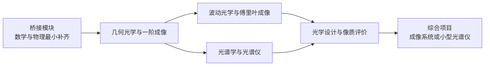

# 光学入门微专业学习计划与路线图

## 执行摘要

这份报告把“光学小白快速入门”重构成一个可直接自学执行的**微专业**：先用一个低门槛桥接模块补最少量的数学、物理与术语，再依次进入**几何光学与成像**、**波动光学与傅里叶成像**、**光谱学与光谱仪**、**光学设计与像质评价**，最后用一个综合项目把成像、光谱和设计连起来。这样安排的依据是：北大《光学》把几何光学、波动光学、光源/探测器和前沿作为基础主线；浙大与电子科大的《应用光学》把理想成像、典型系统和像差作为设计前的工程桥梁；哈工大《物理光学》把干涉、衍射、偏振、吸收/色散/散射作为后续科研与工程基础；电子科大《信息光学》进一步把二维傅里叶变换、标量衍射、光学传递函数与 Matlab 建模连接起来；北京理工大学《光学系统设计与工艺》则把像质评价、光学设计理论和软件实践接到一起。citeturn11view0turn11view1turn11view2turn11view3turn11view5

如果你的目标是“尽快能看懂光学系统、能读懂成像/光谱论文、能开始做简单设计”，最优策略不是一上来啃《Principles of Optics》这类重理论经典，而是采用**应用优先、数学够用、仿真先行、项目牵引**的路线。这个判断有直接依据：电子科大《应用光学》明确说明课程“侧重于基础概念建立，适用于各个年级的学生，特别是初学者”；MIT 的 “Understanding Lasers and Fiberoptics” 也明确面向“little or no background” 的学习者，并强调数学最小化；Ansys 的 “Fundamentals of Optics” 学习轨道则明确写明**不假定任何先验光学知识**。citeturn11view4turn13view5turn17view0

因此，这份微专业的核心目标不是把你立刻训练成“会推全套电磁边界条件的理论型学生”，而是让你在三到十二个月内达到以下可操作水平：能画主光线并计算一阶成像；能解释 PSF、OTF、MTF、数值孔径、衍射极限与光谱分辨率；能用 Python 或 OpticStudio/RayOptics 做最基本的光学建模；能独立完成一个“小型成像镜头分析”或“简易光谱仪”课程项目。上述技能目标直接对应了高校课程目标、工业软件入门路径和标准教材的覆盖范围。citeturn11view1turn11view3turn12view2turn17view4turn19search0

## 设计原则与总体路径

本微专业采用“**先语言、后成像；先近轴、后波动；先解释系统、后优化系统**”的逻辑。原因很现实：北大《光学》要求具备电磁学基础，电子科大《应用光学》要求微积分和大学物理，说明正规大学光学课默认学习者并不是零基础；而 Ansys 的入门学习轨道与 MIT 的低门槛视频课恰好补上了这一缺口，所以最合理的自学版本应该先做桥接，再进入大学课程主干。citeturn11view0turn11view4turn17view0turn13view5

学习时请始终维护一套自己的“**三本账**”：一本概念账，专记术语、单位、近似条件和适用边界；一本计算账，记录所有常用公式与典型题型；一本项目账，持续沉淀仿真脚本、实验照片、误差分析与阶段总结。这样做非常符合 MIT 项目实验课与 Ansys 入门轨道的教学精神：既重概念，也重可复现实操。MIT 现代光学实验课把问题集、实验、演示和项目并行安排；Ansys 的入门与软件设计资源也强调从“定义规格—分析性能—优化系统”的完整闭环来学习。citeturn14view1turn17view0turn12view2

建议的软件与工具栈分为两层。**基础层**：Jupyter + Python + NumPy/Matplotlib，用于作图、单位换算、简单几何和频域计算；**光学层**：RayOptics 做几何与近轴分析，POPPY 做 Fraunhofer/Fresnel 衍射与 PSF 仿真；若你希望走工业软件路线，则可使用 Ansys Student 中包含的 OpticStudio Student。RayOptics 官方文档明确说明它提供几何光线追迹、像差分析、近轴图解，并支持导入 Zemax/CODE V 文件；POPPY 官方文档说明它用于 Fraunhofer/Fresnel 衍射与 PSF 建模；Ansys 官方则说明从 2025R2 起 OpticStudio Student 已纳入 Ansys Student，适合学生获得光学设计与分析的实操经验。citeturn17view4turn17view5turn19search0

## 微专业模块体系

**微专业名称：光学基础与成像系统入门**

**完成标准**：完成全部五个模块；提交至少一个综合项目报告；完成每模块自测；最终能独立阅读一篇基础成像/光谱/设计论文并复述其系统结构、关键指标与限制条件。这个能力目标与北大、浙大、哈工大、电子科大和北理工相关课程的教学目标高度对齐。citeturn11view0turn11view1turn11view2turn11view3turn11view5

**模块甲｜桥接模块：数学、物理与光学语言**

目标：建立“会用级”数学与物理直觉，掌握波长、频率、能量、折射率、焦距、放大率、NA、F/#、PSF、分辨率等最基本术语，为后续课程消除语言障碍。把桥接单列出来，是因为北大《光学》要求电磁学基础，电子科大《应用光学》要求微积分和大学物理；而 MIT 的低门槛课程和 Ansys 的 Fundamentals of Optics 正好提供零基础入口。citeturn11view0turn11view4turn13view5turn17view0

先修知识：无硬性要求；只需初中代数、愿意补一点三角函数和导数的直观意义即可。citeturn17view0turn13view5

核心概念：电磁波与光的波长/频率关系；折射率与传播速度；反射、折射与薄透镜成像；基本三角函数；导数作为“变化率”；积分作为“累积量”；单位换算与数量级估计。北大的课程导论、MIT 2.71 第一讲、Khan Academy 中文“几何光学”和“电磁波与干涉”都可作为这一层的概念入口。citeturn14view0turn9search2turn9search18

推荐教材/在线课程：MIT OCW《Single Variable Calculus》用于最少量微积分补齐；MIT 《Understanding Lasers and Fiberoptics》用于弱数学、重直观的光学入门；Ansys《Fundamentals of Optics》用于建立工程语境；可汗学院中文的“几何光学”“电磁波与干涉”适合碎片化补漏洞。英文教材建议以 Hecht《Optics》作第一本系统教材，SPIE 的《Field Guide to Optical Engineering》作速查手册。citeturn9search0turn13view5turn17view0turn9search2turn9search18turn11view6turn21search5

实践项目/实验：用手机和放大镜做一次“物距—像距—放大率”记录；用 Python 画出可见光波段与频率/能量对应图；制作个人光学术语表；把任意一台相机或显微镜拆成“光源—物体—物镜—孔径—像面—探测器”语言描述。以上实践与 MIT 的直观教学方式及 Ansys 的规格—系统—性能框架一致。citeturn13view5turn17view0

评估方式：一份术语测验；一份单位与量纲小测；一篇“我如何理解一个成像系统”的 800 字短文。预计学习时长：15–25 小时。难度等级：低。  

**模块乙｜几何光学与一阶成像**

目标：能用光线模型解释成像，掌握薄透镜、近轴成像、孔径与视场、放大率、景深、数值孔径、典型系统结构，并初步理解像差从哪里来。浙大《应用光学》和电子科大《应用光学》都把这部分定位为进一步做系统设计的基础。citeturn11view1turn11view4

先修知识：模块甲完成即可。若你已经能熟练使用薄透镜公式和画主光线，可直接压缩本模块前半。citeturn11view4

核心概念：近轴近似、成像公式、主平面/焦点、孔径光阑、入瞳/出瞳、视场、数值孔径、F/#、显微镜/望远镜/照相物镜等典型系统；同时建立“理想系统—实际系统—像差与限制”的工程视角。浙大课程明确覆盖理想系统、光束限制、典型系统和像差；电子科大课程强调几何光学成像规律、像差理论和像质评价是后续设计基础。citeturn11view1turn11view4

推荐教材/在线课程：中文优先顺序建议为电子科大《应用光学》→ 浙江大学《应用光学》→ 北京大学《光学》中的几何部分；英文教材建议 Hecht《Optics》打底，再配 Smith《Modern Optical Engineering》建立工程直觉。MIT 6.161 的课程日历也可用来识别这部分与望远镜、显微镜、ray-matrix 方法之间的关系。citeturn11view4turn11view1turn11view0turn11view6turn16search0turn14view1

实践项目/实验：用两片廉价透镜搭一个简单成像系统；测量成像倍率与景深的变化；比较不同孔径下图像清晰度；整理一页“显微镜、望远镜、相机的共同框架”。若会 Python，可用 ABCD 矩阵做近轴仿真。MIT 6.161 将几何光学、显微镜、望远镜和 ray-matrix 方法放在同一教学单元，非常适合照着搭框架。citeturn14view1

评估方式：完成 15–20 道一阶成像题；独立画出三种典型系统光路；提交一个带尺寸计算的简单成像系统作业。预计学习时长：30–45 小时。难度等级：低到中。  

**模块丙｜波动光学、衍射与傅里叶成像**

目标：从“光线为什么不够”切入，理解干涉、衍射、偏振、相干、PSF/OTF/MTF、傅里叶变换与成像频率特性，完成从几何光学到信息光学的关键跃迁。哈工大《物理光学》、电子科大《信息光学》、MIT 2.71 和 MIT 6.161 的组合，正好构成这条主线。citeturn11view2turn11view5turn14view0turn14view1

先修知识：需要具备模块乙中的近轴成像概念；对三角函数与复数记号不熟也没关系，但至少要接受“振幅+相位”的语言。citeturn11view2turn11view5

核心概念：相干与干涉条件；单缝/双缝/圆孔衍射； Airy 斑与分辨率；偏振与 Jones/Mueller 的最基本思想；傅里叶变换在透镜中的角色；PSF、OTF、MTF 与像质；部分相干、空间滤波和全息的最初步概念。电子科大《信息光学》明确覆盖二维傅里叶变换、标量衍射、成像系统频率特性、部分相干、全息和 Matlab 建模；MIT 6.161 课程日历把衍射、全息、Fourier optics、探测器等紧密连在一起。citeturn11view5turn14view1

推荐教材/在线课程：中文主资源为哈工大《物理光学》和电子科大《信息光学》；英文核心教材为 Goodman《Introduction to Fourier Optics》；想靠仿真把概念“看见”，可以用 POPPY，其官方文档明确支持 Fraunhofer/Fresnel 传播和 PSF 形成。作为工程衔接，Edmund Optics 的 MTF 教程适合快速理解为什么工业界常用 MTF 比较系统性能。citeturn11view2turn11view5turn12view1turn17view5turn12view7

实践项目/实验：优先做仿真，不要求一开始就搭激光实验。建议先用 Python/POPPY 画单缝、圆孔、Airy 斑、4f 系统频谱滤波；有条件时再做低功率、安全条件下的衍射/干涉演示。MIT 6.161 的实验安排说明，衍射、全息和 Fourier optics 的理解非常适合“短讲 + 仿真 + 实验”的混合方式。citeturn14view1turn17view5

评估方式：完成一份“PSF/OTF/MTF 概念图”；写出一次仿真报告；能口头解释“为什么缩小孔径会同时改善某些像差表现、又会引入更强衍射限制”。预计学习时长：35–55 小时。难度等级：中。  

**模块丁｜光谱学与光谱仪**

目标：掌握“光谱是什么、为什么有信息、仪器如何把波长分开、分辨率由什么限制、怎样校准和解释数据”。NIST、NASA、HORIBA 与 Ansys 的官方资料非常适合作为这一模块的骨架。citeturn12view8turn14view2turn12view6turn13view1

先修知识：完成模块甲和模块乙即可；如果完成模块丙，会更容易理解仪器分辨率和衍射极限。citeturn14view2turn13view1

核心概念：连续谱、发射谱、吸收谱；谱线、带宽、分辨率；光栅方程基本直觉；入射狭缝、准直、色散元件、聚焦和探测器组成的仪器链；Czerny–Turner 等典型结构；像元—波长映射与标定；谱仪分辨率与狭缝宽度、像差、探测器像元和衍射的关系。NIST 将 spectroscopy 定义为“利用光与物质相互作用获取信息”；NASA 的 Spectroscopy 101 则非常清楚地说明了谱告诉我们成分、温度、密度和运动；HORIBA 与 Ansys 官方资料则把仪器结构、bandpass/FWHM、检测器宽度与衍射极限说得很工程。citeturn12view8turn14view2turn12view6turn13view0turn13view1

推荐教材/在线课程：中文建议从 NIST/NASA/HORIBA 的科普与工程资料建立直觉，再补中国大学 MOOC 上的《分析化学（二）：仪器分析》或相关“波谱学/化学实验”课程中的 UV-Vis、IR、荧光、拉曼部分；英文官方资源优先看 NIST Atomic Spectroscopy Compendium、NASA Spectroscopy 101 系列、HORIBA 的 spectrometer notes。若你以后更偏实验，可直接阅读 MIT Junior Lab 的 Doppler-free spectroscopy 实验指导。citeturn1search0turn1search4turn18search10turn18search4turn14view2turn13view0turn17view6

实践项目/实验：做一个简易手机光谱仪或至少完成“公开光谱数据的读取—峰值定位—标定—解释”流程；尝试比较不同狭缝宽度或不同像元尺寸对光谱分辨率的影响；画出一台 Czerny–Turner 光谱仪的结构草图。HORIBA 的基本设计页面和 Ansys 的 spectrometer tutorial 都能直接为这些项目提供结构模板。citeturn12view6turn13view1

评估方式：能够解释一张光谱图的横轴、纵轴、峰宽、峰位和噪声源；完成一次像元到波长的简单校准；写出“如果我设计一个小型可见光谱仪，我先确定哪些参数”的设计清单。预计学习时长：25–40 小时。难度等级：中。  

**模块戊｜光学设计、像差与像质评价**

目标：把前四个模块的概念压缩成“规格—结构—分析—优化—容差”的设计闭环，至少能独立完成一个单透镜或简单多片系统的初步设计、分析和报告。北京理工大学课程、Ansys 教育资源、RayOptics 文档以及 Smith / Kingslake / Mahajan / Sasián 的书单是这一模块的核心依据。citeturn11view3turn17view0turn12view2turn17view4turn16search0turn21search2turn7search1turn20search7

先修知识：建议先完成前四个模块；如果目标只是“能开始用软件搭系统”，可先完成模块乙与模块丙后再进入这一模块。citeturn11view3turn12view2

核心概念：像差的种类与物理含义；波前误差；Spot diagram、Ray fan、OPD、PSF、MTF、畸变、照度等常见评价指标；规格分解与权衡；优化目标函数；制造与装调误差的基本意识。Edmund 的 MTF 教程明确指出 MTF 是比较系统性能的常用指标；北理工《光学系统设计与工艺》明确强调像质评价、像差理论、设计软件和典型系统设计；Ansys 的入门教程则把“搭系统—分析性能—优化”作为明确学习结果。citeturn12view7turn11view3turn12view2

推荐教材/在线课程：中文首选北京理工大学《光学系统设计与工艺》；若要走软件路线，直接跟 Ansys 的 Fundamentals of Optics Learning Track 与 “Basic Lens Design in Zemax OpticStudio” 教程；若想避免软件门槛，先用 RayOptics。英文经典教材建议按“Smith《Modern Optical Engineering》→ Kingslake & Johnson《Lens Design Fundamentals》→ Mahajan《Aberration Theory Made Simple》→ Sasián《Introduction to Aberrations in Optical Imaging Systems》”的顺序推进；有条件者可把 CODE V 作为行业拓展了解。citeturn11view3turn17view0turn12view3turn17view4turn16search0turn21search10turn7search1turn20search7turn2search0

实践项目/实验：必须至少做一个综合项目。推荐二选一：其一，按 Ansys 的入门教程设计并优化一个单透镜成像系统，再补做 MTF、Spot、畸变和规格说明；其二，利用 Ansys spectrometer theory 或 RayOptics 自拟一个小型光谱仪方案，写出狭缝、焦距、探测器宽度与分辨率之间的权衡。Ansys 的教程明确指出单透镜入门例子已经足以引出智能手机镜头和医学成像等高级应用的基本设计思想。citeturn12view3turn13view1

评估方式：提交一份完整设计报告，至少包括系统需求、结构图、关键参数、像质评价、问题与改进建议；如果采用开源路线，则提交 RayOptics / Python 脚本和结果图。预计学习时长：40–60 小时。难度等级：中到高。  

## 三种节奏的时间表与里程碑

下面的节奏不是“谁更正确”，而是针对不同周投入做的压缩与展开版本。它的依据不是凭空分配，而是把高校课程的覆盖范围、Ansys 的零基础学习轨道和教材体量压缩成一个自学可执行版本。若你每周投入不稳定，我建议**优先选常规六个月版**；三个月版只适合愿意每周稳定投入较多时间的人。citeturn11view0turn11view1turn11view2turn11view3turn17view0

| 阶段 | 速成三个月 | 常规六个月 | 慢速十二个月 | 阶段里程碑 |
| --- | --- | --- | --- | --- |
| 周投入建议 | 12–18 小时/周 | 6–10 小时/周 | 3–5 小时/周 | 保证“每周至少一次计算、一次阅读、一次实践” |
| 桥接模块 | 第 1–2 周 | 第 1–4 周 | 第 1–8 周 | 能完成单位换算、薄透镜与最小数学补齐 |
| 几何光学与成像 | 第 3–5 周 | 第 5–10 周 | 第 9–18 周 | 能独立画主光线、算放大率和理解视场/孔径 |
| 波动光学与傅里叶成像 | 第 6–8 周 | 第 11–17 周 | 第 19–30 周 | 能解释衍射、Airy 斑、PSF/OTF/MTF 与 4f 概念 |
| 光谱学与光谱仪 | 第 9–10 周 | 第 18–21 周 | 第 31–38 周 | 能看懂一张光谱图，理解狭缝—分辨率—通光量权衡 |
| 光学设计与像质评价 | 第 11–12 周 | 第 22–24 周 | 第 39–48 周 | 能完成单透镜或简易谱仪的分析/优化/报告 |
| 最终输出 | 一份短项目报告 | 一份完整设计报告 + 仿真代码 | 一份完整设计报告 + 扩展阅读复盘 | 达到“可继续进阶”的起点 |

如果你只想“最快建立整体视野”，三个月版的抓手是：桥接只学最少够用的数学；几何和波动只抓最常用概念；光谱只做到“能解释仪器与数据”；设计只做单透镜或单一谱仪方案。六个月版则可以真正完成一轮“概念—题目—仿真—项目”的闭环；十二个月版最适合把教材、MOOC、软件和实验都做扎实的人。这个分层方式与 MIT 的项目课节奏、Ansys 的分级学习轨迹以及国内课程由“基础光学—应用光学/信息光学—系统设计”的顺序一致。citeturn14view1turn17view0turn11view1turn11view5turn11view3

## 模块关键习题与答案要点

**模块甲｜桥接模块**

1. 题目：为什么说“波长、频率、能量”是学习光学时必须同时掌握的三个量？  
   答案要点：因为光既可作为波讨论传播与干涉，也常用光子能量讨论与物质相互作用；波长决定空间尺度直觉，频率决定振荡快慢，能量则与吸收/发射过程直接相关，它们之间可通过基本关系互相换算。citeturn12view8turn14view2

2. 题目：为什么零基础学习者也要尽早接受“折射率不是材料标签，而是传播参数”的说法？  
   答案要点：因为折射率会直接进入折射、传播速度、成像位置和色散讨论；把它仅当作“玻璃种类编号”会阻断你理解成像与波动统一框架。citeturn14view0turn11view0

3. 题目：为什么薄透镜公式能作为光学入门的第一公式，但不能作为全部光学的核心？  
   答案要点：它在近轴、理想、单透镜近似下极其高效，适合建立一阶成像直觉；但一旦进入大孔径、宽视场、衍射极限和真实多片系统，就必须引入像差、波动与像质评价。citeturn11view1turn11view4turn12view7

4. 题目：什么叫“导数在光学里只要会用，不必一开始会严密证明”？  
   答案要点：对初学者更重要的是把导数看成“某个光学量对另一个量的敏感度或变化率”，比如位置—波长映射的斜率、像差随孔径变化的趋势，而不是先做严格数学证明。citeturn9search0turn13view1

5. 题目：为什么这份微专业要把 Python/作图能力放在最前面？  
   答案要点：因为现代光学学习离不开可视化和仿真；RayOptics、POPPY 以及 Ansys 教学资源都默认学习者会读图、看曲线和解释仿真结果。citeturn17view4turn17view5turn12view2

**模块乙｜几何光学与一阶成像**

1. 题目：为什么同样是“看远处”，相机、望远镜和显微镜的设计思维却不同？  
   答案要点：因为三者虽都属于成像系统，但目标物距、数值孔径、视场、像方要求和最终探测/观察方式不同；《应用光学》把这些典型系统单列，正是为了说明共同规律与差异化设计目标。citeturn11view1turn11view4

2. 题目：孔径光阑为什么既影响亮度，又影响成像质量？  
   答案要点：孔径首先限制通光量和光束范围，从而影响照度；同时它也决定哪些边缘光线被接纳，因此会影响像差表现、景深和衍射极限。citeturn11view1turn12view7

3. 题目：为什么“会画图”在应用光学里不是低级能力，而是核心能力？  
   答案要点：浙大《应用光学》明确强调几何光学要重视画图，因为物像关系、光束限制、视场和孔径位置若不先图解，后面的尺寸与系统理解会非常抽象。citeturn11view1

4. 题目：为什么近轴成像是设计的起点而不是终点？  
   答案要点：近轴模型帮助你快速确定焦距、放大率、系统长度等一阶参数；但真实设计还要进一步考虑像差、照度、分辨率、畸变和制造误差。citeturn11view4turn11view3turn12view7

5. 题目：如何判断某个问题该先用几何光学还是直接上波动光学？  
   答案要点：若问题主要关心物像位置、放大率、视场、瞳和系统布局，通常先用几何光学；若关心分辨率、衍射、干涉、相位、PSF/MTF，则必须引入波动视角。citeturn11view1turn11view2turn11view5

**模块丙｜波动光学、衍射与傅里叶成像**

1. 题目：为什么“相干”是很多初学者在干涉问题里最容易忽略、却又最关键的前提？  
   答案要点：因为干涉图样不是“只要两束光相遇就有”，而是对相位关系稳定性有要求；MIT 现代光学课把 temporal/spatial coherence 放在干涉前，就是为了避免把干涉误认为纯几何重叠。citeturn14view1

2. 题目：为什么一个点物体经过系统后不会严格成“点”？  
   答案要点：因为真实光学系统受衍射及可能的像差限制，点物体会被映射成 PSF；Ansys 的 spectrometer theory 页面也明确用点源—模糊像来解释衍射限制。citeturn13view1turn17view5

3. 题目：为什么傅里叶光学不是“数学炫技”，而是成像分析的压缩语言？  
   答案要点：因为透镜、孔径、衍射和频率响应在傅里叶框架里能被统一描述；Goodman 的教材和电子科大的《信息光学》都把傅里叶变换当作成像频率分析的核心工具。citeturn11view5turn12view1

4. 题目：为什么工业界如此重视 MTF，而不是只给一个“分辨率数字”？  
   答案要点：因为 MTF 把对比度随空间频率变化的信息保留下来，比单一分辨率数更能反映系统在不同细节尺度上的真实性能。Edmund 的教程明确指出 MTF 是比较系统性能的常用方法。citeturn12view7

5. 题目：为什么 4f 系统和空间滤波在入门阶段值得学？  
   答案要点：因为它让你第一次真正看到“图像—频谱—再成像”的关系，是从几何光学跨入信息光学最直观的桥。MIT 6.161 把 Fourier optics、classical two-lens processor 和滤波放在同一段课程中，正说明它的枢纽地位。citeturn14view1

**模块丁｜光谱学与光谱仪**

1. 题目：为什么光谱相比普通图像更擅长回答“是什么”和“处于什么状态”这两个问题？  
   答案要点：因为图像主要给出空间形状与结构，而光谱记录了亮度随波长变化的细节，可用于推断组成、温度、密度和运动。NASA 的 Spectroscopy 101 对此解释得非常直接。citeturn14view2turn14view3

2. 题目：为什么谱仪中的狭缝不能无限做宽？  
   答案要点：狭缝越宽通光量通常越大，但带宽会变宽、分辨率会下降；HORIBA 的 bandpass 说明明确把狭缝宽度作为影响 bandpass/FWHM 的关键因素之一。citeturn13view0

3. 题目：Czerny–Turner 结构为什么成为学习入门谱仪时的典型模板？  
   答案要点：因为它用“入射狭缝—准直镜—平面光栅—聚焦镜—探测器”的清晰链路，把分光、成像和机械调节逻辑展示得最直观。HORIBA 的说明页面明确给出了这一配置及其用途。citeturn12view6

4. 题目：为什么谱仪分辨率不能只靠“加长焦距”来无脑提升？  
   答案要点：因为更长焦距虽然会把谱拉得更开，但衍射斑和系统尺寸也会随之变化；Ansys 的 spectrometer theory 页面明确指出仅仅加大聚焦镜焦距并不会自动提高最终谱仪分辨率。citeturn13view1

5. 题目：为什么波长标定是任何实用光谱分析前都必须做的步骤？  
   答案要点：因为探测器原始输出常只是像元位置，只有把像元坐标映射到实际波长，峰位、峰宽和材料判断才有物理意义。Ansys 的示例专门给出了 detector position 到 wavelength 的映射函数讨论。citeturn13view1

**模块戊｜光学设计、像差与像质评价**

1. 题目：为什么真正的光学设计不是“把焦距定出来”就结束？  
   答案要点：因为真实设计必须同时满足视场、孔径、像质、结构尺寸、制造成本和容差要求；北理工课程把像质评价、像差理论、设计软件和典型系统设计放在同一门课里，就是因为这些因素必须联立考虑。citeturn11view3

2. 题目：为什么零基础做设计时最适合从单透镜系统开始？  
   答案要点：Ansys 的 Basic Lens Design 明确说明单透镜 sequential 模式教程面向 complete beginners，且足以建立光学设计原则的实践基础。citeturn12view3

3. 题目：为什么像差学习既要看“几何图像”，又要看“波前语言”？  
   答案要点：几何图像便于直观看到模糊形态，波前语言则更适合统一分析与优化；Mahajan、Sasián 和 RayOptics/POPPY 等资源共同说明了从几何到波前的双重视角是现代像质分析的基础。citeturn7search1turn20search7turn17view4turn17view5

4. 题目：为什么 MTF、Spot diagram、distortion、relative illumination 不应孤立看？  
   答案要点：因为它们分别反映对比度传递、点像扩展、几何保真和能量分布，单看任何一个都可能误判系统整体可用性。Edmund 对 MTF 的解释和北理工对像质评价的课程定位都支持这一点。citeturn12view7turn11view3

5. 题目：什么时候应该用开源工具，什么时候应该用工业软件？  
   答案要点：当目标是理解原理、快速试算和低成本入门时，用 RayOptics/POPPY 很合适；当目标转向行业流程、复杂优化和容差分析时，OpticStudio 或 CODE V 更接近工程实际。RayOptics 文档、Ansys 学生版说明和 CODE V 官方产品页共同表明了这种分层使用策略。citeturn17view4turn19search0turn2search0

## 进阶资源与研究方向建议

如果你在完成微专业后只再买三本英文书，我建议优先是：Hecht《Optics》作为广覆盖入门主教材；Goodman《Introduction to Fourier Optics》作为波动与成像核心；Smith《Modern Optical Engineering》作为系统工程与设计直觉教材。若你希望继续走深，可再加 Kingslake & Johnson《Lens Design Fundamentals》、Born & Wolf《Principles of Optics》、Saleh & Teich《Fundamentals of Photonics》以及 Sasián / Mahajan 的像差书。它们分别覆盖“广基础—傅里叶成像—工程设计—透镜设计—经典理论—现代光子学—像差分析”七个层级。citeturn11view6turn12view1turn16search0turn21search10turn21search19turn21search24turn20search7turn7search1

中文资源方面，最值得反复使用的是：北大《光学》做总论与概念；浙大/电子科大《应用光学》做成像与像差；哈工大《物理光学》做波动与偏振；电子科大《信息光学》做傅里叶与系统频率特性；北理工《光学系统设计与工艺》做设计收束。如果时间有限，最有效的组合不是“多门同时看”，而是按本报告模块顺序从这些课程中抽取对应章节学习。citeturn11view0turn11view1turn11view2turn11view4turn11view5turn11view3

若你希望补“英文原始文献/原始经典”，建议按下面顺序阅读，而不要一开始通读全部内容。**Abbe 1873** 的《Beiträge zur Theorie des Mikroskops…》对应现代显微成像与分辨率讨论的源头；**Zernike 1942** 的 phase contrast 论文对应相位物体可见化这一经典突破；**Hopkins 1950** 的《Wave Theory of Aberrations》是现代像差理论的重要里程碑；若走现代教材路线，则 Goodman 与 Born & Wolf 分别代表傅里叶成像与经典电磁光学的两大支柱。citeturn15search2turn15search0turn6search3turn12view1turn21search19

研究方向方面，完成这套微专业后，最自然的四个进阶方向是：**计算成像**、**高光谱/成像光谱**、**自由曲面与智能光学设计**、**超快与非线性成像/光谱**。这不是主观罗列，而是当前学术与工程会议中持续活跃的方向：Optica 的 COSI 会议明确把 optics、detectors、signal processing 与 machine learning 的协同作为核心；SPIE 的相关会议与征稿长期覆盖 computational imaging、hyperspectral imaging、freeform optics、AI in lens design，以及 ultrafast nonlinear imaging and spectroscopy。citeturn22search13turn22search29turn22search2turn22search7turn22search27turn22search6

最后给你的方向建议是：如果你更喜欢“看得见”的系统，走**成像 + 设计**；如果你更喜欢“测得准”的系统，走**光谱 + 仪器**；如果你更喜欢“算法和物理一起写”，走**计算成像/计算光谱**。从学习成本与转化效率看，完成本微专业后，最适合的第一份综合作品通常不是“做一个完美镜头”，而是**做一个可解释、可复现、指标清晰的小系统**：例如单透镜成像分析、4f 空间滤波仿真、小型可见光谱仪设计，或成像系统 MTF 与 PSF 的对比报告。这样的训练路径既对接高校课程，也对接工业软件和后续科研。citeturn12view2turn17view4turn17view5turn13view1