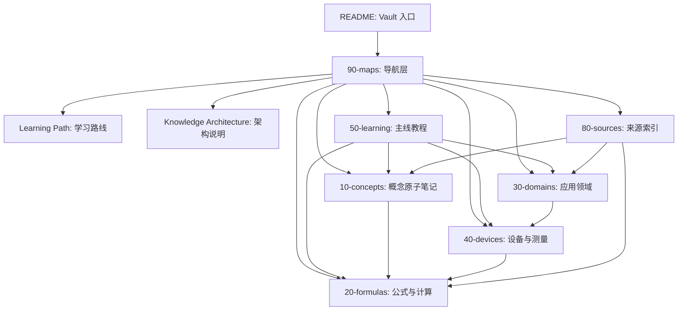
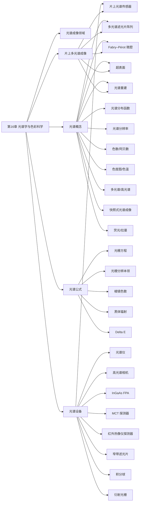

# 知识库架构

这套 Vault 的目标不是堆资料，而是把光学知识拆成几类稳定对象：主线教程负责“怎么学”，概念负责“是什么”，公式负责“怎么算”，设备负责“怎么落地”，领域负责“在什么场景下取舍”。

## 总体结构

## 五层知识模型

| 层级 | 目录 | 解决的问题 | 典型内容 |
|---|---|---|---|
| 学习层 | `50-learning/` | 从零按什么顺序学 | 16 章教程、练习、工程案例 |
| 概念层 | `10-concepts/` | 一个术语到底是什么意思 | 焦距、F 值、色散、光谱分辨率 |
| 公式层 | `20-formulas/` | 已知参数如何计算 | 薄透镜、视角、奈奎斯特、光栅方程 |
| 领域层 | `30-domains/` | 场景如何改变选型标准 | 工业视觉、摄影、显微镜、红外、光谱成像 |
| 设备层 | `40-devices/` | 真实硬件如何选择和调试 | 镜头、传感器、光源、光谱仪、滤光片 |

`80-sources/` 是证据层，负责保存标准、论文、厂商资料和确认日期。当前该层仍待补强。

## 主线教程架构

主线教程分四段：

| 阶段 | 章节 | 学习目标 |
|---|---|---|
| 入门 | 00-09 | 建立光、镜头、传感器和选型的直觉 |
| 进阶 | 10-13 | 理解波动光学、像质评价、光学设计和照明 |
| 深入 | 14 | 了解计算成像和算法如何改变成像系统 |
| 实战/专项 | 15-16 | 用工程案例串联知识，并深入光谱与色彩科学 |

推荐入口：[[Learning Path|从零到深入学习路径]]。

## 光谱知识子图

光谱相关知识已经形成独立子图：

入口顺序建议：

1. [[50-learning/01-light-and-waves|第1章：光与波]]
2. [[10-concepts/dispersion|色散]]
3. [[10-concepts/spectral-power-distribution|光谱分布函数]]
4. [[50-learning/16-spectroscopy|第16章：光谱学与色彩科学]]
5. [[30-domains/spectroscopy|光谱成像]]
6. [[40-devices/spectrometer|光谱仪]] 和 [[40-devices/hyperspectral-camera|高光谱相机]]
7. [[30-domains/on-chip-multispectral|片上多光谱成像]]（专项深入，可选）
8. [[10-concepts/snapshot-spectral-imaging|快照式光谱成像]]、[[10-concepts/multispectral-filter-array|多光谱滤光片阵列]]、[[10-concepts/fabry-perot-microcavity|Fabry–Pérot 微腔]]、[[10-concepts/metasurface|超表面]]、[[10-concepts/spectral-reconstruction|光谱重建]]（按需深入）

## 当前缺口

| 缺口 | 影响 | 建议 |
|---|---|---|
| 来源层薄弱 | 部分公式和经验结论缺少可追溯来源 | 优先为第10-16章、光谱公式补标准/教材/厂商资料 |
| 一些旧双链仍指向“第X章”占位名 | Obsidian 图谱中会出现未创建节点 | 逐步改成实际文件名，如 `16-spectroscopy` |
| 基础工程术语尚未全部原子化 | 设备笔记里会引用未建概念 | 对高频术语建小笔记，低频术语保留在设备页解释 |
| 光谱内容多为 draft | 适合学习，但不宜直接作为工程标准 | 对公式、单位、典型波段做一次来源校验后升为 reviewed；片上多光谱专题已建骨架，待审阅 |

## 维护原则

- 主线教程只负责顺序讲解，不把每个术语都塞进长篇。
- 概念笔记保持短小，重点写边界、误区和关联。
- 公式笔记必须包含变量、单位、适用条件和至少一个算例。
- 设备笔记必须写清关键参数、选型陷阱和适用场景。
- 领域笔记用于综合取舍，避免重复解释基础概念。
