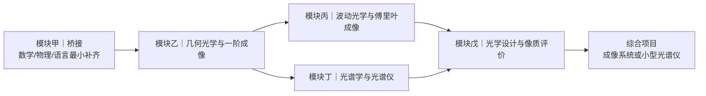
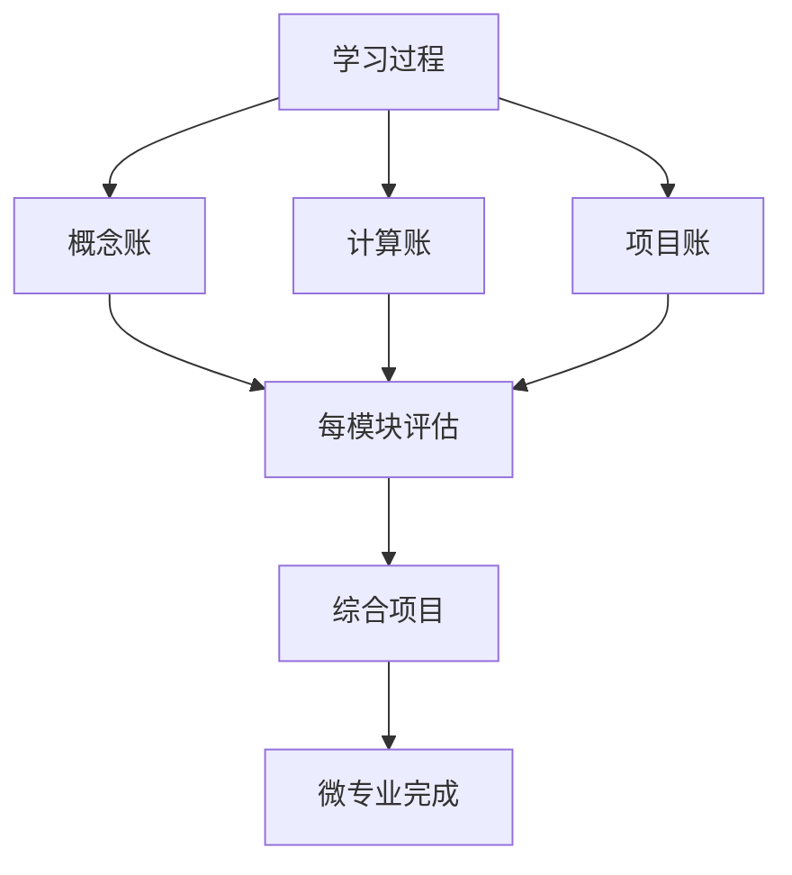

# LensFit 知识库重构计划：微专业五模块体系映射

> 基于 `deep-research-report.md` 微专业方法论，将现有 LensFit 知识库从「章节线性结构」重构为「模块环形结构」。
> 
> **重构目标**：使知识库从「按章节顺序阅读」转为「按模块能力构建」，支持三种学习节奏（3月/6月/12月），并维护「三本账」体系（概念账、计算账、项目账）。
> 
> **文档版本**：v1.0  
> **生成日期**：2026-07-03  
> **状态**：规划草案，待评审后执行

---

## 目录

- [任务1：Content-Mapping（内容映射）](#任务1-content-mapping内容映射)
- [任务2：Directory-Restructure（目录重构）](#任务2-directory-restructure目录重构)
- [任务3：Learning-Route（学习路线）](#任务3-learning-route学习路线)
- [任务4：Project-Assessment（项目与评估）](#任务4-project-assessment项目与评估)
- [行动项与优先级](#行动项与优先级)

---

## 任务1：Content-Mapping（内容映射）

### 1.1 映射原则

| 原则 | 说明 |
|------|------|
| **单一归属优先** | 每个文件尽量归入一个主模块，避免多头管理 |
| **可拆分标记** | 当文件内容横跨多个模块时，标注「需拆分」并指明拆分方向 |
| **可新增标记** | 当模块存在内容缺口时，标注「需新增」并说明补充内容 |
| **Obsidian 双链兼容** | 映射方案必须保留现有 `[[wiki-link]]` 的可达性，迁移时同步更新链接 |
| **原子笔记保留** | `10-concepts/`、`20-formulas/` 的原子笔记特性不变，按模块重新分目录存放 |

### 1.2 五模块定义与边界



| 模块 | 核心能力 | 边界说明 |
|------|---------|---------|
| **模块甲｜桥接** | 建立「会用级」数学与物理直觉，掌握最基本术语 | 只补最小必要量：折射率、波长-频率-能量、基本术语、薄透镜公式、单位换算 |
| **模块乙｜几何光学与一阶成像** | 能用光线模型解释成像，掌握典型系统结构 | 含近轴、成像公式、孔径、视场、典型系统、像差、传感器匹配、接口、领域应用 |
| **模块丙｜波动光学与傅里叶成像** | 理解干涉、衍射、相干、PSF/OTF/MTF、傅里叶 | 从「光线为什么不够」切入，完成几何→波动的关键跃迁 |
| **模块丁｜光谱学与光谱仪** | 掌握光谱原理、仪器结构和分辨率限制 | 含色散、光栅/棱镜、Czerny-Turner、波长标定、多光谱/高光谱 |
| **模块戊｜光学设计与像质评价** | 建立「规格—结构—分析—优化—容差」闭环 | 含像差深入、波前、评价指标、设计软件、容差、工程案例 |

### 1.3 学习章节映射（50-learning/）

| 现有文件 | 当前主题 | 归属模块 | 处理方式 | 备注 |
|---------|---------|---------|---------|------|
| `00-introduction.md` | 绪论：走进成像光学 | **模块甲** | 保留为主入口，新增「微专业导航」段落 | 作为模块甲的 README 入口 |
| `01-light-and-waves.md` | 光与波 | **模块甲** | 保留 | 核心桥接内容：波长、频率、能量、折射率 |
| `02-geometric-optics.md` | 几何光学 | **模块乙** | 保留 | 模块乙核心章节 |
| `03-lens-parameters.md` | 镜头参数 | **模块乙** | 保留 | 焦距、F值、像圈、景深、NA |
| `04-sensors.md` | 传感器 | **模块乙** | 保留 | 作为一阶系统组件理解 |
| `05-matching-basics.md` | 匹配基础 | **模块乙** | 保留 | 镜头-传感器匹配 |
| `06-aberrations.md` | 像差 | **模块乙**（主）+ **模块戊**（辅） | **需拆分** | 前4节（色差、球差、彗差、像散入门）→ 模块乙；后4节（波前像差、高级分析、设计关联）→ 模块戊 |
| `07-interfaces-and-mounts.md` | 接口与安装 | **模块乙** | 保留 | 工程基础，属于一阶系统能力 |
| `08-domain-applications.md` | 领域应用 | **模块乙** | 保留 | 工业视觉、摄影、显微镜、红外 |
| `09-exercises.md` | 习题与练习 | **跨模块** | **需拆分** | 按模块拆分为 5 份独立习题集，每模块一份 |
| `10-physical-optics-advanced.md` | 物理光学深入 | **模块丙** | 保留 | 干涉、衍射、相干、偏振 |
| `11-optical-design-basics.md` | 光学设计基础 | **模块戊** | 保留 | 模块戊核心章节 |
| `12-otf-and-image-quality.md` | OTF与图像质量 | **模块丙**（主）+ **模块戊**（辅） | **需拆分** | 前6节（PSF/OTF/MTF概念、傅里叶基础）→ 模块丙；后4节（像质综合评价、设计关联、容差）→ 模块戊 |
| `13-illumination-design.md` | 照明系统设计 | **模块乙**（主）+ **模块丁**（辅） | **需拆分** | 照明方式、几何布局 → 模块乙；光谱特性、光源SPD、色温 → 模块丁 |
| `14-computational-optics.md` | 计算光学 | **模块丙**（主）+ **模块戊**（辅） | **需拆分** | 前5节（超分辨、光场、编码孔径，与波动/傅里叶紧密相关）→ 模块丙；后3节（设计优化、深度学习辅助设计）→ 模块戊 |
| `15-engineering-cases.md` | 工程案例 | **模块戊** | 保留 | 作为模块戊的「综合项目」牵引 |
| `16-spectroscopy.md` | 光谱学与色彩科学 | **模块丁** | 保留 | 模块丁核心章节 |
| `Understanding CMOS Image Sensor.md` | CMOS传感器深度 | **模块乙**（主）+ **模块丁**（辅） | **需拆分** | 像素结构、读出噪声、动态范围 → 模块乙；光谱响应、QE曲线、色彩滤波阵列 → 模块丁 |

### 1.4 概念原子笔记映射（10-concepts/）

#### 模块甲｜桥接（8个概念）

| 概念文件 | 当前 slug | 处理方式 | 备注 |
|---------|----------|---------|------|
| `000-refractive-index.md` | 折射率 | 迁移 → 模块甲 | 核心桥接概念 |
| `050-polarization.md` + `051-偏振.md` | 偏振 | 合并后迁移 → 模块甲 | 波动基础，桥接模块需要 |
| `052-漫射.md` | 漫射 | 迁移 → 模块甲 | 基础光学现象 |
| `053-镜面反射.md` | 镜面反射 | 迁移 → 模块甲 | 基础光学现象 |
| — | **新增** | 波长-频率-能量关系 | 模块甲缺口：需要独立解释 `c = λf` 和 `E = hf` |
| — | **新增** | 单位换算与数量级估计 | 模块甲缺口：nm/μm/mm、Hz/THz、 eV 的直觉 |
| — | **新增** | 导数作为变化率（光学直觉版） | 模块甲缺口：敏感度概念，如像差随孔径变化 |
| — | **新增** | 三角函数在光学中的最小使用集 | 模块甲缺口：sin/cos/arctan 在折射和视角中的使用 |

#### 模块乙｜几何光学与一阶成像（22个概念）

| 概念文件 | 当前 slug | 处理方式 | 备注 |
|---------|----------|---------|------|
| `001-近轴近似.md` | 近轴近似 | 迁移 → 模块乙 | 几何光学核心近似 |
| `003-focal-length.md` + `004-焦距.md` | 焦距 | 合并后迁移 → 模块乙 | 核心概念 |
| `005-f-number.md` | F值 | 迁移 → 模块乙 | 核心概念 |
| `006-数值孔径.md` | 数值孔径 | 迁移 → 模块乙 | 核心概念 |
| `007-depth-of-field.md` | 景深 | 迁移 → 模块乙 | 核心概念 |
| `008-放大倍率.md` | 放大倍率 | 迁移 → 模块乙 | 核心概念 |
| `009-image-circle.md` + `010-像圈.md` | 像圈 | 合并后迁移 → 模块乙 | 核心概念 |
| `011-视场.md` | 视场 | 迁移 → 模块乙 | 核心概念 |
| `012-视角.md` | 视角 | 迁移 → 模块乙 | 核心概念 |
| `013-透视畸变.md` | 透视畸变 | 迁移 → 模块乙 | 核心概念 |
| `014-视差.md` | 视差 | 迁移 → 模块乙 | 核心概念 |
| `015-法兰距.md` | 法兰距 | 迁移 → 模块乙 | 核心概念 |
| `016-abbe-number.md` | 阿贝数 | 迁移 → 模块乙 | 色散概念，一阶像差理解需要 |
| `017-dispersion.md` + `018-色散.md` | 色散 | 合并后迁移 → 模块乙 | 核心概念 |
| `019-chromatic-aberration.md` + `020-色差.md` | 色差 | 合并后迁移 → 模块乙 | 核心概念 |
| `080-双远心.md` | 双远心 | 迁移 → 模块乙 | 典型系统概念 |
| `054-半影.md` | 半影 | 迁移 → 模块乙 | 照明与孔径相关 |
| `055-均匀性.md` | 均匀性 | 迁移 → 模块乙 | 工程概念 |
| `056-平场.md` | 平场 | 迁移 → 模块乙 | 工程概念 |
| `057-渐晕.md` | 渐晕 | 迁移 → 模块乙 | 工程概念 |
| `002-工作距离.md` | 工作距离 | **补全内容** → 模块乙 | 当前 stub，需补全 |
| — | **新增** | 孔径光阑 / 入瞳 / 出瞳 | 模块乙缺口：光束限制概念 |
| — | **新增** | 主平面 / 焦点 | 模块乙缺口：近轴系统核心概念 |
| — | **新增** | 显微镜 / 望远镜 / 照相物镜的共性与差异 | 模块乙缺口：典型系统框架 |

#### 模块丙｜波动光学与傅里叶成像（14个概念）

| 概念文件 | 当前 slug | 处理方式 | 备注 |
|---------|----------|---------|------|
| `021-interference.md` + `022-干涉.md` | 干涉 | 合并后迁移 → 模块丙 | 核心概念 |
| `023-diffraction-grating.md` + `024-衍射光栅.md` | 衍射光栅 | **需拆分** → 模块丙（基础）+ 模块丁（光谱应用） | 光栅基础原理 → 模块丙；光栅在光谱仪中的角色 → 模块丁 |
| `025-diffraction-limit.md` + `026-衍射极限.md` | 衍射极限 | 合并后迁移 → 模块丙 | 核心概念 |
| `027-airy-disk.md` + `028-艾里斑.md` | 艾里斑 | 合并后迁移 → 模块丙 | 核心概念 |
| `029-瑞利判据.md` | 瑞利判据 | 迁移 → 模块丙 | 核心概念 |
| `030-psf.md` + `031-点扩散函数.md` | 点扩散函数 | 合并后迁移 → 模块丙 | 核心概念 |
| `032-otf.md` + `033-光学传递函数.md` | 光学传递函数 | 合并后迁移 → 模块丙 | 核心概念 |
| `034-mtf.md` + `035-调制传递函数.md` | 调制传递函数 | 合并后迁移 → 模块丙 | 核心概念 |
| `036-pixel.md` | 像元 | 迁移 → 模块丙 | 采样理论需要 |
| `038-nyquist-frequency.md` + `039-奈奎斯特频率.md` | 奈奎斯特频率 | 合并后迁移 → 模块丙 | 采样理论核心 |
| `040-aliasing.md` + `041-混叠.md` | 混叠 | 合并后迁移 → 模块丙 | 采样理论核心 |
| `042-过采样.md` | 过采样 | 迁移 → 模块丙 | 采样理论核心 |
| `043-边缘检测.md` | 边缘检测 | 迁移 → 模块丙 | 计算成像相关 |
| `049-分光镜.md` | 分光镜 | 迁移 → 模块丙 | 波动光学器件 |
| — | **新增** | 相干（ temporal / spatial ） | 模块丙缺口：干涉前提 |
| — | **新增** | 傅里叶变换在光学中的角色 | 模块丙缺口：4f系统、频谱 |
| — | **新增** | 部分相干 | 模块丙缺口：真实光源的相干特性 |
| — | **新增** | 全息术基础 | 模块丙缺口：信息光学入门 |

#### 模块丁｜光谱学与光谱仪（17个概念）

| 概念文件 | 当前 slug | 处理方式 | 备注 |
|---------|----------|---------|------|
| `066-spectral-power-distribution.md` | 光谱分布函数 | 迁移 → 模块丁 | 核心概念 |
| `067-color-temperature.md` + `068-色温.md` | 色温 | 合并后迁移 → 模块丁 | 核心概念 |
| `069-chromaticity-diagram.md` | 色度图 | 迁移 → 模块丁 | 核心概念 |
| `070-fluorescence.md` | 荧光 | 迁移 → 模块丁 | 核心概念 |
| `071-raman-scattering.md` | 拉曼散射 | 迁移 → 模块丁 | 核心概念 |
| `072-multispectral-imaging.md` | 多光谱成像 | 迁移 → 模块丁 | 核心概念 |
| `073-hyperspectral-imaging.md` | 高光谱成像 | 迁移 → 模块丁 | 核心概念 |
| `074-spectral-resolution.md` | 光谱分辨率 | 迁移 → 模块丁 | 核心概念 |
| `075-snapshot-spectral-imaging.md` | 快照式光谱成像 | 迁移 → 模块丁 | 核心概念 |
| `076-multispectral-filter-array.md` | 多光谱滤光片阵列 | 迁移 → 模块丁 | 核心概念 |
| `077-fabry-perot-microcavity.md` | Fabry-Perot 微腔 | 迁移 → 模块丁 | 核心概念 |
| `078-metasurface.md` | 超表面 | 迁移 → 模块丁 | 核心概念 |
| `079-spectral-reconstruction.md` | 光谱重建 | 迁移 → 模块丁 | 核心概念 |
| — | **新增** | 连续谱 / 发射谱 / 吸收谱 | 模块丁缺口 |
| — | **新增** | 光栅方程与角色散 | 模块丁缺口（从现有衍射光栅拆分） |
| — | **新增** | 狭缝宽度与带宽 / FWHM | 模块丁缺口 |
| — | **新增** | Czerny-Turner 结构 | 模块丁缺口 |
| — | **新增** | 波长标定 | 模块丁缺口 |

#### 模块戊｜光学设计与像质评价（8个概念）

| 概念文件 | 当前 slug | 处理方式 | 备注 |
|---------|----------|---------|------|
| `058-全局快门.md` | 全局快门 | 迁移 → 模块戊 | 传感器性能评价 |
| `059-卷帘快门.md` | 卷帘快门 | 迁移 → 模块戊 | 传感器性能评价 |
| `060-动态范围.md` | 动态范围 | 迁移 → 模块戊 | 核心概念 |
| `061-读出噪声.md` | 读出噪声 | 迁移 → 模块戊 | 核心概念 |
| `062-NETD.md` | NETD | 迁移 → 模块戊 | 红外系统评价 |
| `063-微测辐射热计.md` | 微测辐射热计 | 迁移 → 模块戊 | 红外探测器 |
| `064-发射率.md` | 发射率 | 迁移 → 模块戊 | 红外系统评价 |
| `065-果冻效应.md` | 果冻效应 | 迁移 → 模块戊 | 系统性能评价 |
| — | **新增** | Spot Diagram | 模块戊缺口 |
| — | **新增** | Ray Fan | 模块戊缺口 |
| — | **新增** | OPD / 波前误差 | 模块戊缺口 |
| — | **新增** | 畸变（畸变类型与测量） | 模块戊缺口 |
| — | **新增** | 相对照度 | 模块戊缺口 |
| — | **新增** | 优化目标函数 | 模块戊缺口 |
| — | **新增** | 容差分析 | 模块戊缺口 |
| — | **新增** | 制造与装调误差 | 模块戊缺口 |

#### 照明概念跨模块处理（6个概念）

| 概念文件 | 处理方式 | 备注 |
|---------|---------|------|
| `044-illumination-geometry.md` + `045-照明方式.md` | **需拆分** | 几何布局部分 → 模块乙；光谱/SPD部分 → 模块丁 |
| `046-同轴照明.md` | 迁移 → 模块乙 | 工业视觉照明 |
| `047-低角度照明.md` | 迁移 → 模块乙 | 工业视觉照明 |
| `048-远心照明.md` | 迁移 → 模块乙 | 工业视觉照明 |

### 1.5 公式原子笔记映射（20-formulas/）

#### 模块甲｜桥接（2个公式）

| 公式文件 | 当前 slug | 处理方式 | 备注 |
|---------|----------|---------|------|
| `000-thin-lens-gauss.md` | 薄透镜高斯公式 | 迁移 → 模块甲 | 桥接模块的核心第一公式 |
| `015-planck-blackbody.md` | 普朗克黑体辐射 | 迁移 → 模块甲 | 基础物理 |
| — | **新增** | 波长-频率-能量换算 | `c = λf`、`E = hf` |
| — | **新增** | 折射率与速度关系 | `n = c/v` |

#### 模块乙｜几何光学与一阶成像（7个公式）

| 公式文件 | 当前 slug | 处理方式 | 备注 |
|---------|----------|---------|------|
| `001-lateral-magnification.md` | 横向放大倍率 | 迁移 → 模块乙 | 核心公式 |
| `002-focal-length-from-wd.md` | 焦距反推 | 迁移 → 模块乙 | 核心公式 |
| `003-angle-of-view.md` | 视角公式 | 迁移 → 模块乙 | 核心公式 |
| `004-coverage-ratio.md` | 像圈覆盖比 | 迁移 → 模块乙 | 核心公式 |
| `005-pixel-precision.md` | 像素精度 | 迁移 → 模块乙 | 核心公式 |
| `006-nyquist-frequency.md` | 奈奎斯特频率 | **迁移 → 模块丙** | 采样理论属于波动/信息光学 |
| `007-oversampling-ratio.md` | 过采样率 | **迁移 → 模块丙** | 采样理论属于波动/信息光学 |

#### 模块丙｜波动光学与傅里叶成像（7个公式）

| 公式文件 | 当前 slug | 处理方式 | 备注 |
|---------|----------|---------|------|
| `008-airy-disk-diameter.md` | 艾里斑直径 | 迁移 → 模块丙 | 核心公式 |
| `009-rayleigh-criterion.md` | 瑞利判据 | 迁移 → 模块丙 | 核心公式 |
| `010-瑞利分辨率.md` | 瑞利分辨率 | 迁移 → 模块丙 | 核心公式 |
| `011-double-slit-fringe-spacing.md` | 双缝条纹间距 | 迁移 → 模块丙 | 核心公式 |
| `012-grating-equation.md` | 光栅方程 | **需拆分** → 模块丙（基础）+ 模块丁（光谱应用） | 基础方程 → 模块丙；在光谱仪中的角色 → 模块丁 |
| `013-grating-resolving-power.md` | 光栅光谱分辨率 | **需拆分** → 模块丙（基础）+ 模块丁（光谱应用） | 同上 |
| `006-nyquist-frequency.md` | 奈奎斯特频率 | 迁移 → 模块丙 | 采样理论 |
| `007-oversampling-ratio.md` | 过采样率 | 迁移 → 模块丙 | 采样理论 |
| — | **新增** | 傅里叶变换对（光学版） | 模块丙缺口：1D/2D 的物↔频关系 |
| — | **新增** | 透镜的傅里叶变换性质 | 模块丙缺口：4f 系统核心公式 |

#### 模块丁｜光谱学与光谱仪（3个公式）

| 公式文件 | 当前 slug | 处理方式 | 备注 |
|---------|----------|---------|------|
| `014-prism-dispersion.md` | 棱镜色散率 | 迁移 → 模块丁 | 核心公式 |
| `016-delta-e.md` | Delta E 色差 | 迁移 → 模块丁 | 核心公式 |
| `012-grating-equation.md`（光谱应用部分） | 光栅方程（光谱版） | 迁移 → 模块丁 | 从模块丙拆分 |
| `013-grating-resolving-power.md`（光谱应用部分） | 光栅分辨率（光谱版） | 迁移 → 模块丁 | 从模块丙拆分 |
| — | **新增** | 光谱仪分辨率综合公式 | 模块丁缺口：狭缝+像差+像元+衍射的联合限制 |
| — | **新增** | 像元-波长映射公式 | 模块丁缺口：标定核心 |
| — | **新增** | CIE XYZ 三刺激值积分 | 从原 `20-formulas/README.md` 待补列表迁移 |

#### 模块戊｜光学设计与像质评价（0个现有公式，需新增）

| 公式 | 状态 | 备注 |
|------|------|------|
| 斯特列尔比（Strehl Ratio） | **新增** | 波前质量评价 |
| RMS 波前误差 | **新增** | 波前质量评价 |
| 几何光学 MTF 近似 | **新增** | 设计阶段快速估算 |
| 光学传递函数（OTF）= MTF·e^(iPTF) | **新增** | 设计评价 |
| 塞德尔像差系数（初步） | **新增** | 像差理论深入 |

### 1.6 领域笔记映射（30-domains/）

| 现有文件 | 当前主题 | 归属模块 | 处理方式 | 备注 |
|---------|---------|---------|---------|------|
| `000-industrial-vision.md` | 工业视觉 | **模块乙** | 保留 | 典型应用领域 |
| `001-photography.md` | 摄影 | **模块乙** | 保留 | 典型应用领域 |
| `002-microscopy.md` | 显微镜 | **模块乙** | 保留 | 典型应用领域 |
| `003-infrared-imaging.md` | 红外成像 | **模块乙** | 保留 | 典型应用领域 |
| `004-spectroscopy.md` | 光谱成像 | **模块丁** | 保留 | 模块丁核心领域 |
| `005-on-chip-multispectral.md` | 片上多光谱 | **模块丁** | 保留 | 模块丁核心领域 |

### 1.7 设备笔记映射（40-devices/）

#### 模块乙｜几何光学与一阶成像（9个设备）

| 设备文件 | 当前主题 | 处理方式 | 备注 |
|---------|---------|---------|------|
| `000-c-mount-lens.md` | C-mount镜头 | 迁移 → 模块乙 | 典型工业镜头 |
| `001-telecentric-lens.md` | 远心镜头 | 迁移 → 模块乙 | 测量系统核心 |
| `002-microscope-objective.md` | 显微镜物镜 | 迁移 → 模块乙 | 显微系统核心 |
| `003-global-shutter-cmos.md` | 全局快门CMOS | 迁移 → 模块乙 | 传感器基础 |
| `004-rolling-shutter-cmos.md` | 卷帘快门CMOS | 迁移 → 模块乙 | 传感器基础 |
| `005-backlight.md` | 背光板 | 迁移 → 模块乙 | 照明设备 |
| `006-led-ring-light.md` | LED环形光源 | 迁移 → 模块乙 | 照明设备 |
| `007-coaxial-illumination.md` | 同轴照明 | 迁移 → 模块乙 | 照明设备 |
| `008-telecentric-illumination.md` | 远心照明 | 迁移 → 模块乙 | 照明设备 |

#### 模块丁｜光谱学与光谱仪（6个设备）

| 设备文件 | 当前主题 | 处理方式 | 备注 |
|---------|---------|---------|------|
| `009-bandpass-filter.md` | 窄带滤光片 | 迁移 → 模块丁 | 光谱设备 |
| `010-diffraction-grating.md` | 衍射光栅 | 迁移 → 模块丁 | 光谱核心元件 |
| `011-spectrometer.md` | 光谱仪 | 迁移 → 模块丁 | 光谱核心设备 |
| `012-hyperspectral-camera.md` | 高光谱相机 | 迁移 → 模块丁 | 光谱核心设备 |
| `013-on-chip-spectral-sensor.md` | 片上光谱传感器 | 迁移 → 模块丁 | 光谱核心设备 |
| `014-integrating-sphere.md` | 积分球 | 迁移 → 模块丁 | 光谱测量设备 |

#### 模块戊｜光学设计与像质评价（3个设备）

| 设备文件 | 当前主题 | 处理方式 | 备注 |
|---------|---------|---------|------|
| `015-ir-thermal-detector.md` | 红外热像仪探测器 | 迁移 → 模块戊 | 红外探测器评价 |
| `016-ingaas-focal-plane-array.md` | InGaAs焦平面阵列 | 迁移 → 模块戊 | 红外探测器评价 |
| `017-mct-detector.md` | MCT探测器 | 迁移 → 模块戊 | 红外探测器评价 |

### 1.8 知识地图映射（90-maps/）

| 现有文件 | 当前主题 | 归属 | 处理方式 | 备注 |
|---------|---------|------|---------|------|
| `000-Knowledge Map.md` | 知识地图 | **通用** | 保留并更新 | 新增五模块节点 |
| `001-Learning Path.md` | 学习路径 | **通用** | **替换** | 被本文档的「任务3」取代 |
| `002-Knowledge Architecture.md` | 知识架构 | **通用** | 保留并更新 | 更新为模块环形架构 |
| `003-Visual Learning Toolkit.md` | 视觉学习工具包 | **通用** | 保留 | 跨模块通用 |
| `004-Visual Index.md` | 视觉索引 | **通用** | 保留 | 跨模块通用 |
| `005-Interactive Explorer.md` | 交互式探索器 | **通用** | 保留并更新 | 需适配新模块入口 |
| `006-Obsidian Setup.md` | Obsidian 设置 | **通用** | 保留 | 跨模块通用 |
| `007-Optics Lab.md` | 光学实验室 | **通用** | 保留并更新 | 按模块标注实验归属 |
| `008-On-chip Multispectral Topic.md` | 片上多光谱专题 | **模块丁** | 保留 | 模块丁专题地图 |
| `学习路线.md` | 现有学习路线 | **通用** | **替换** | 被本文档的「任务3」取代 |

### 1.9 其他资源映射

| 资源 | 归属 | 处理方式 | 备注 |
|------|------|---------|------|
| `80-sources/` 教材索引 | **通用** | 保留 | 按模块新增推荐阅读标注 |
| `templates/` 模板 | **通用** | 保留 | 新增模块 README 模板 |
| `.compute/README.md` | 计算脚本说明 | **通用** | 保留 |
| `.compute/plan_cmos_lab.md` | CMOS Lab 设计 | **模块乙+戊** | 保留并更新归属 |
| `.compute/scripts/` 脚本 | **通用** | 按模块重新组织 | 迁移到各模块的 `projects/` 下 |
| `attachments/` 附件 | **通用** | 保留 | 按模块建子目录 |

### 1.10 映射总结统计

| 类别 | 现有数量 | 迁移后分布 | 新增需求 | 需拆分 |
|------|---------|-----------|---------|--------|
| 学习章节 | 17 个 | 甲:2, 乙:6, 丙:3, 丁:1, 戊:2, 跨:3 | 0 | 6 个文件需拆分 |
| 概念笔记 | 80 个（含中英文） | 甲:8, 乙:24, 丙:18, 丁:17, 戊:15, 跨:6 | ~12 个 | 4 个概念需拆分 |
| 公式笔记 | 17 个 | 甲:4, 乙:5, 丙:9, 丁:5, 戊:5 | ~5 个 | 2 个公式需拆分 |
| 领域笔记 | 6 个 | 乙:4, 丁:2 | 0 | 0 |
| 设备笔记 | 18 个 | 乙:9, 丁:6, 戊:3 | 0 | 0 |
| 知识地图 | 9 个 | 通用:9 | 0 | 2 个需更新替换 |

---

## 任务2：Directory-Restructure（目录重构）

### 2.1 设计原则

1. **模块环形**：从「章节线性」→「模块环形」，每个模块可独立进入、独立闭环
2. **Obsidian 双链保留**：所有 `[[wiki-link]]` 通过迁移脚本批量更新，不破坏链接关系
3. **原子笔记保持**：概念、公式保持「一个文件一个原子」的特性
4. **通用资源顶层**：跨模块的教材、工具、附件放在顶层，避免重复
5. **项目牵引**：每个模块有 `projects/` 目录，存放仿真脚本和实验指导
6. **评估闭环**：每个模块有 `assessment/` 目录，存放自测题和答案要点

### 2.2 新目录结构（tree 视图）

```
OpticKnowledgeSpace/
│
├── 📁 README.md                          # 知识库总入口：微专业导航
│
├── 📁 00-meta/                           # 元信息（跨模块通用）
│   ├── templates/
│   │   ├── Concept.md                    # 概念笔记模板
│   │   ├── Formula.md                    # 公式笔记模板
│   │   ├── Source.md                     # 来源笔记模板
│   │   ├── Textbook.md                   # 教材笔记模板
│   │   ├── Module-README.md              # 模块入口模板 [新增]
│   │   └── Project-Report.md             # 项目报告模板 [新增]
│   ├── .compute/
│   │   ├── README.md
│   │   ├── scripts/                      # 通用计算脚本（如单位换算工具）
│   │   └── cmos_sensor_lab/              # 保留，但更新归属说明
│   │       ├── app.py
│   │       ├── core/
│   │       ├── pages/
│   │       └── utils/
│   └── plan_cmos_lab.md                  # 设计方案保留
│
├── 📁 10-bridge/                         # 模块甲｜桥接：数学/物理/语言最小补齐
│   ├── README.md                         # 模块入口：目标、先修、路线、三本账指引
│   ├── 00-introduction.md                  # 原 50-learning/00-introduction.md → 迁移
│   ├── 01-light-and-waves.md             # 原 50-learning/01-light-and-waves.md → 迁移
│   ├── concepts/
│   │   ├── refractive-index.md           # 原 10-concepts/000-refractive-index.md
│   │   ├── polarization.md               # 合并 050+051
│   │   ├── diffuse-reflection.md         # 原 052
│   │   ├── specular-reflection.md        # 原 053
│   │   ├── wavelength-frequency-energy.md # [新增] 波长-频率-能量关系
│   │   ├── units-and-orders.md            # [新增] 单位换算与数量级
│   │   ├── derivative-intuition.md        # [新增] 导数作为变化率
│   │   └── trig-minimum.md                # [新增] 三角函数最小使用集
│   ├── formulas/
│   │   ├── thin-lens-gauss.md            # 原 20-formulas/000
│   │   ├── planck-blackbody.md           # 原 20-formulas/015
│   │   ├── wavelength-frequency.md        # [新增] c=λf, E=hf
│   │   └── refractive-index-velocity.md   # [新增] n=c/v
│   ├── projects/
│   │   ├── p01-phone-magnifier.md        # [新增] 手机+放大镜物距像距实验
│   │   ├── p02-visible-light-chart.md    # [新增] Python 画可见光波段对应图
│   │   ├── p03-personal-glossary.md      # [新增] 个人光学术语表
│   │   └── p04-system-description.md     # [新增] 拆解任意成像系统描述
│   └── assessment/
│       ├── q01-terminology-quiz.md       # [新增] 术语测验
│       ├── q02-units-dimension.md        # [新增] 单位与量纲小测
│       └── q03-system-essay.md           # [新增] 800字短文
│
├── 📁 20-geometric-optics/               # 模块乙｜几何光学与一阶成像
│   ├── README.md
│   ├── 02-geometric-optics.md            # 原 50-learning/02
│   ├── 03-lens-parameters.md             # 原 50-learning/03
│   ├── 04-sensors.md                     # 原 50-learning/04
│   ├── 05-matching-basics.md             # 原 50-learning/05
│   ├── 06-aberrations-geo.md             # 原 50-learning/06 → 前4节拆分
│   ├── 07-interfaces-and-mounts.md       # 原 50-learning/07
│   ├── 08-domain-applications.md         # 原 50-learning/08
│   ├── concepts/
│   │   ├── paraxial-approximation.md     # 原 001
│   │   ├── focal-length.md               # 合并 003+004
│   │   ├── f-number.md                   # 原 005
│   │   ├── numerical-aperture.md         # 原 006
│   │   ├── depth-of-field.md             # 原 007
│   │   ├── lateral-magnification.md      # 原 008
│   │   ├── image-circle.md               # 合并 009+010
│   │   ├── field-of-view.md              # 原 011
│   │   ├── angle-of-view.md              # 原 012
│   │   ├── perspective-distortion.md     # 原 013
│   │   ├── parallax.md                   # 原 014
│   │   ├── flange-distance.md            # 原 015
│   │   ├── abbe-number.md                # 原 016
│   │   ├── dispersion.md                 # 合并 017+018
│   │   ├── chromatic-aberration.md       # 合并 019+020
│   │   ├── double-telecentric.md         # 原 080
│   │   ├── penumbra.md                   # 原 054
│   │   ├── uniformity.md                 # 原 055
│   │   ├── flatness.md                   # 原 056
│   │   ├── vignetting.md                 # 原 057
│   │   ├── working-distance.md           # 原 002 → 补全内容
│   │   ├── aperture-pupil.md             # [新增] 孔径光阑/入瞳/出瞳
│   │   ├── principal-plane.md            # [新增] 主平面/焦点
│   │   ├── typical-systems.md            # [新增] 显微镜/望远镜/相机框架
│   │   ├── coaxial-illumination.md       # 原 046
│   │   ├── low-angle-illumination.md     # 原 047
│   │   └── telecentric-illumination.md   # 原 048
│   ├── formulas/
│   │   ├── lateral-magnification.md      # 原 001
│   │   ├── focal-length-from-wd.md       # 原 002
│   │   ├── angle-of-view.md              # 原 003
│   │   ├── coverage-ratio.md             # 原 004
│   │   └── pixel-precision.md            # 原 005
│   ├── domains/
│   │   ├── industrial-vision.md          # 原 30-domains/000
│   │   ├── photography.md                # 原 30-domains/001
│   │   ├── microscopy.md                 # 原 30-domains/002
│   │   └── infrared-imaging.md           # 原 30-domains/003
│   ├── devices/
│   │   ├── c-mount-lens.md               # 原 000
│   │   ├── telecentric-lens.md           # 原 001
│   │   ├── microscope-objective.md       # 原 002
│   │   ├── global-shutter-cmos.md        # 原 003
│   │   ├── rolling-shutter-cmos.md       # 原 004
│   │   ├── backlight.md                  # 原 005
│   │   ├── led-ring-light.md             # 原 006
│   │   ├── coaxial-illumination.md       # 原 007
│   │   └── telecentric-illumination.md   # 原 008
│   ├── projects/
│   │   ├── p01-two-lens-imaging.md       # [新增] 两片廉价透镜成像
│   │   ├── p02-magnification-dof.md      # [新增] 测量倍率与景深
│   │   ├── p03-aperture-clarity.md       # [新增] 不同孔径清晰度对比
│   │   ├── p04-system-framework.md       # [新增] 三种典型系统共同框架
│   │   └── p05-paraxial-simulation.md    # [新增] ABCD矩阵近轴仿真
│   └── assessment/
│       ├── q01-15-imaging-problems.md    # 原 09-exercises 拆分
│       ├── q02-ray-diagrams.md           # [新增] 画三种系统光路
│       └── q03-sizing-assignment.md      # [新增] 带尺寸计算的成像系统
│
├── 📁 30-wave-optics/                    # 模块丙｜波动光学与傅里叶成像
│   ├── README.md
│   ├── 10-physical-optics-advanced.md    # 原 50-learning/10
│   ├── 12-otf-and-image-quality.md     # 原 50-learning/12 → 前6节拆分
│   ├── 14-computational-optics.md      # 原 50-learning/14 → 前5节拆分
│   ├── concepts/
│   │   ├── interference.md               # 合并 021+022
│   │   ├── diffraction-grating.md        # 原 023+024 → 基础部分保留
│   │   ├── diffraction-limit.md          # 合并 025+026
│   │   ├── airy-disk.md                  # 合并 027+028
│   │   ├── rayleigh-criterion.md         # 原 029
│   │   ├── psf.md                        # 合并 030+031
│   │   ├── otf.md                        # 合并 032+033
│   │   ├── mtf.md                        # 合并 034+035
│   │   ├── pixel.md                      # 原 036
│   │   ├── nyquist-frequency.md          # 合并 038+039
│   │   ├── aliasing.md                   # 合并 040+041
│   │   ├── oversampling.md               # 原 042
│   │   ├── edge-detection.md             # 原 043
│   │   ├── beam-splitter.md              # 原 049
│   │   ├── coherence.md                  # [新增] temporal/spatial coherence
│   │   ├── fourier-optics.md             # [新增] 傅里叶变换在光学中的角色
│   │   ├── partial-coherence.md          # [新增] 部分相干
│   │   └── holography-basics.md          # [新增] 全息术基础
│   ├── formulas/
│   │   ├── airy-disk-diameter.md         # 原 008
│   │   ├── rayleigh-criterion.md         # 原 009
│   │   ├── rayleigh-resolution.md        # 原 010
│   │   ├── double-slit-fringe.md         # 原 011
│   │   ├── grating-equation.md           # 原 012 → 基础部分
│   │   ├── grating-resolving-power.md    # 原 013 → 基础部分
│   │   ├── nyquist-frequency.md          # 原 006
│   │   ├── oversampling-ratio.md         # 原 007
│   │   ├── fourier-transform-pair.md     # [新增] 光学傅里叶变换对
│   │   └── lens-fourier-property.md      # [新增] 透镜的傅里叶性质
│   ├── projects/
│   │   ├── p01-single-slit-simulation.md # [新增] POPPY 单缝仿真
│   │   ├── p02-circular-aperture-psf.md  # [新增] 圆孔 Airy 斑仿真
│   │   ├── p03-4f-system-filter.md       # [新增] 4f 系统频谱滤波
│   │   ├── p04-mtf-concept-map.md        # [新增] PSF/OTF/MTF 概念图
│   │   └── p05-aperture-tradeoff.md      # [新增] 孔径像差-衍射权衡分析
│   └── assessment/
│       ├── q01-psf-otf-mtf-concept.md    # [新增] 概念图测验
│       ├── q02-simulation-report.md      # [新增] 仿真报告
│       └── q03-aperture-tradeoff-oral.md # [新增] 孔径权衡口头解释
│
├── 📁 40-spectroscopy/                   # 模块丁｜光谱学与光谱仪
│   ├── README.md
│   ├── 13-illumination-spectrum.md       # 原 50-learning/13 → 光谱部分拆分
│   ├── 16-spectroscopy.md                # 原 50-learning/16
│   ├── concepts/
│   │   ├── spectral-power-distribution.md # 原 066
│   │   ├── color-temperature.md          # 合并 067+068
│   │   ├── chromaticity-diagram.md       # 原 069
│   │   ├── fluorescence.md               # 原 070
│   │   ├── raman-scattering.md           # 原 071
│   │   ├── multispectral-imaging.md      # 原 072
│   │   ├── hyperspectral-imaging.md      # 原 073
│   │   ├── spectral-resolution.md        # 原 074
│   │   ├── snapshot-spectral.md          # 原 075
│   │   ├── multispectral-filter-array.md # 原 076
│   │   ├── fabry-perot-microcavity.md    # 原 077
│   │   ├── metasurface.md                # 原 078
│   │   ├── spectral-reconstruction.md    # 原 079
│   │   ├── continuous-emission-absorption.md # [新增] 三种谱
│   │   ├── grating-angular-dispersion.md # [新增] 从光栅概念拆分
│   │   ├── slit-width-bandwidth.md       # [新增] 狭缝与带宽
│   │   ├── czerny-turner.md              # [新增] Czerny-Turner 结构
│   │   └── wavelength-calibration.md     # [新增] 波长标定
│   ├── formulas/
│   │   ├── prism-dispersion.md           # 原 014
│   │   ├── delta-e.md                    # 原 016
│   │   ├── grating-equation-spectro.md   # 从原 012 拆分
│   │   ├── grating-resolving-spectro.md  # 从原 013 拆分
│   │   ├── spectrometer-resolution.md    # [新增] 综合分辨率公式
│   │   ├── pixel-wavelength-mapping.md   # [新增] 像元-波长映射
│   │   └── cie-xyz-integral.md           # [新增] CIE XYZ 积分
│   ├── domains/
│   │   ├── spectroscopy.md               # 原 30-domains/004
│   │   └── on-chip-multispectral.md      # 原 30-domains/005
│   ├── devices/
│   │   ├── bandpass-filter.md            # 原 009
│   │   ├── diffraction-grating.md        # 原 010
│   │   ├── spectrometer.md               # 原 011
│   │   ├── hyperspectral-camera.md       # 原 012
│   │   ├── on-chip-spectral-sensor.md    # 原 013
│   │   └── integrating-sphere.md         # 原 014
│   ├── projects/
│   │   ├── p01-phone-spectrometer.md     # [新增] 简易手机光谱仪
│   │   ├── p02-public-spectrum-analysis.md # [新增] 公开光谱数据读取-标定-解释
│   │   ├── p03-slit-resolution-tradeoff.md # [新增] 狭缝宽度 vs 分辨率仿真
│   │   └── p04-czerny-turner-sketch.md   # [新增] Czerny-Turner 结构草图
│   └── assessment/
│       ├── q01-spectrum-interpretation.md # [新增] 解释光谱图
│       ├── q02-wavelength-calibration.md  # [新增] 像元-波长校准
│       └── q03-design-checklist.md        # [新增] 小型光谱仪设计清单
│
├── 📁 50-optical-design/                 # 模块戊｜光学设计与像质评价
│   ├── README.md
│   ├── 06-aberrations-advanced.md        # 原 50-learning/06 → 后4节拆分
│   ├── 11-optical-design-basics.md       # 原 50-learning/11
│   ├── 12-image-quality-evaluation.md    # 原 50-learning/12 → 后4节拆分
│   ├── 14-computational-design.md        # 原 50-learning/14 → 后3节拆分
│   ├── 15-engineering-cases.md           # 原 50-learning/15
│   ├── concepts/
│   │   ├── global-shutter.md             # 原 058
│   │   ├── rolling-shutter.md            # 原 059
│   │   ├── dynamic-range.md              # 原 060
│   │   ├── read-noise.md                 # 原 061
│   │   ├── netd.md                       # 原 062
│   │   ├── microbolometer.md             # 原 063
│   │   ├── emissivity.md                 # 原 064
│   │   ├── rolling-shutter-artifact.md   # 原 065
│   │   ├── spot-diagram.md               # [新增]
│   │   ├── ray-fan.md                    # [新增]
│   │   ├── opd-wavefront-error.md        # [新增]
│   │   ├── distortion.md                 # [新增]
│   │   ├── relative-illumination.md      # [新增]
│   │   ├── merit-function.md             # [新增]
│   │   ├── tolerance-analysis.md         # [新增]
│   │   └── manufacturing-error.md        # [新增]
│   ├── devices/
│   │   ├── ir-thermal-detector.md        # 原 015
│   │   ├── ingaas-fpa.md                 # 原 016
│   │   └── mct-detector.md               # 原 017
│   ├── projects/
│   │   ├── p01-single-lens-design.md     # [新增] Ansys 单透镜设计
│   │   ├── p02-mtf-spot-distortion.md    # [新增] MTF/Spot/畸变综合评价
│   │   ├── p03-specification-report.md   # [新增] 完整规格说明书
│   │   ├── p04-tolerance-analysis.md     # [新增] 容差分析入门
│   │   └── p05-spectrometer-design.md    # [新增] 小型光谱仪方案（可选）
│   └── assessment/
│       ├── q01-design-report.md          # [新增] 完整设计报告
│       ├── q02-rayoptics-script.md       # [新增] 开源路线提交脚本
│       └── q03-comprehensive-review.md   # [新增] 综合评审
│
├── 📁 60-comprehensive/                  # 综合项目（跨模块）
│   ├── README.md
│   ├── p01-single-lens-analysis.md       # [新增] 单透镜成像分析
│   ├── p02-4f-spatial-filter.md          # [新增] 4f 空间滤波仿真
│   ├── p03-mini-spectrometer.md          # [新增] 小型可见光谱仪设计
│   ├── p04-mtf-psf-comparison.md         # [新增] 成像系统 MTF 与 PSF 对比报告
│   └── p05-system-integration.md         # [新增] 完整系统集成项目
│
├── 📁 80-sources/                        # 教材与文献（通用）
│   ├── README.md
│   ├── 000-Textbook Index.md
│   ├── 001-Textbook Reference Matrix.md
│   ├── 002-hecht-optics-5e.md
│   ├── 003-saleh-teich-fundamentals-photonics-3e.md
│   ├── 004-goodman-introduction-fourier-optics-4e.md
│   ├── 005-smith-modern-optical-engineering-4e.md
│   ├── 006-wyszecki-stiles-color-science-2e.md
│   ├── 007-gonzalez-woods-digital-image-processing-4e.md
│   ├── 008-driggers-infrared-electro-optical-systems-3e.md
│   ├── 009-on-chip-multispectral-literature.md
│   └── papers/
│       └── README.md
│
├── 📁 90-maps/                           # 知识地图（通用）
│   ├── README.md
│   ├── 000-Knowledge Map.md              # 更新：五模块环形图
│   ├── 001-Learning Path.md              # [替换] 被本文档任务3取代
│   ├── 002-Knowledge Architecture.md     # 更新：模块环形架构
│   ├── 003-Visual Learning Toolkit.md
│   ├── 004-Visual Index.md
│   ├── 005-Interactive Explorer.md
│   ├── 006-Obsidian Setup.md
│   ├── 007-Optics Lab.md
│   ├── 008-On-chip Multispectral Topic.md
│   ├── 009-Learning-Route.md             # [新增] 任务3输出
│   ├── 010-Project-Assessment.md         # [新增] 任务4输出
│   └── restructure-plan/                 # 本规划文档目录
│       ├── content-mapping.md            # 本文档
│       ├── migration-script.md           # [新增] 迁移脚本说明
│       └── link-check-report.md          # [新增] 链接检查报告
│
├── 📁 attachments/                       # 附件（通用）
│   ├── README.md
│   ├── visuals/                          # 原 attachments/visuals/
│   ├── computed/                         # 原 attachments/computed/
│   ├── 10-bridge/                        # [新增] 按模块分子目录
│   ├── 20-geometric-optics/              # [新增]
│   ├── 30-wave-optics/                   # [新增]
│   ├── 40-spectroscopy/                  # [新增]
│   ├── 50-optical-design/                # [新增]
│   └── 60-comprehensive/               # [新增]
│
└── 📁 学习路线.md → [归档] 旧版学习路线，保留为 legacy-learning-route.md
```

### 2.3 迁移路径说明

#### Phase 1：准备（1-2天）

| 步骤 | 操作 | 负责人 | 产出 |
|------|------|--------|------|
| 1.1 | 备份整个 `OpticKnowledgeSpace/` 目录 | 自动化 | 完整备份 |
| 1.2 | 运行现有链接扫描脚本，导出所有 `[[wiki-link]]` | 自动化 | 链接依赖表 |
| 1.3 | 创建新目录结构（mkdir -p） | 自动化 | 空目录树 |
| 1.4 | 创建迁移脚本 `migrate.py` | 自动化 | 脚本文件 |

#### Phase 2：原子笔记迁移（2-3天）

| 步骤 | 操作 | 说明 |
|------|------|------|
| 2.1 | 迁移 `10-concepts/` → 各模块 `concepts/` | 按映射表移动文件，保留 git 历史 |
| 2.2 | 迁移 `20-formulas/` → 各模块 `formulas/` | 同上 |
| 2.3 | 迁移 `30-domains/` → 模块乙/丁 `domains/` | 同上 |
| 2.4 | 迁移 `40-devices/` → 各模块 `devices/` | 同上 |
| 2.5 | 合并中英文 stub | 如 `003-focal-length.md` + `004-焦距.md` → `focal-length.md` |
| 2.6 | 拆分跨模块文件 | 如 `06-aberrations.md` 拆分为 `06-aberrations-geo.md` + `06-aberrations-advanced.md` |

#### Phase 3：链接更新（1-2天）

| 步骤 | 操作 | 说明 |
|------|------|------|
| 3.1 | 运行链接重定向脚本 | 将旧路径 `[[10-concepts/xxx]]` 更新为 `[[../20-geometric-optics/concepts/xxx]]` 等 |
| 3.2 | 处理相对路径 | 更新 `![[...]]` 图片嵌入和 `[...](...)` Markdown 链接 |
| 3.3 | 验证无死链 | 运行 `obsidian-link-check` 或自定义脚本扫描 |
| 3.4 | 修复断裂链接 | 手动修复自动化无法处理的边界情况 |

#### Phase 4：新增内容填充（3-5天）

| 步骤 | 操作 | 说明 |
|------|------|------|
| 4.1 | 编写 5 个模块的 README.md | 按模板：目标、先修、核心概念、路线、三本账指引 |
| 4.2 | 创建新增概念笔记 | 约 12 个新增概念 |
| 4.3 | 创建新增公式笔记 | 约 5 个新增公式 |
| 4.4 | 创建项目指导文件 | 约 20 个 project/*.md |
| 4.5 | 创建评估文件 | 约 15 个 assessment/*.md |

#### Phase 5：验证与收尾（1天）

| 步骤 | 操作 | 产出 |
|------|------|------|
| 5.1 | 在 Obsidian 中打开新 vault，验证双链网络 | 无断裂链接报告 |
| 5.2 | 运行 `.compute/scripts/` 中的脚本，验证路径 | 所有脚本可正常运行 |
| 5.3 | 更新 `90-maps/` 中的知识地图 | 更新后的地图文件 |
| 5.4 | 归档旧版 `学习路线.md` 为 `legacy-learning-route.md` | 保留历史 |
| 5.5 | 提交 Git 并写迁移日志 | 迁移日志 |

### 2.4 链接兼容性策略

**Obsidian 双链迁移规则**：

| 旧链接格式 | 新链接格式 | 处理方式 |
|-----------|-----------|---------|
| `[[000-refractive-index\|折射率]]` | `[[../10-bridge/concepts/refractive-index\|折射率]]` | 跨模块向上两级 |
| `[[003-focal-length\|焦距]]` | `[[focal-length\|焦距]]` | 同模块内同级，简化路径 |
| `[[10-concepts/027-airy-disk\|艾里斑]]` | `[[../30-wave-optics/concepts/airy-disk\|艾里斑]]` | 按映射表更新路径 |
| `[[20-formulas/000-thin-lens-gauss\|薄透镜公式]]` | `[[../10-bridge/formulas/thin-lens-gauss\|薄透镜公式]]` | 按映射表更新路径 |
| `[[30-domains/000-industrial-vision\|工业视觉]]` | `[[domains/industrial-vision\|工业视觉]]` | 同模块内简化 |
| `[[40-devices/011-spectrometer\|光谱仪]]` | `[[../40-spectroscopy/devices/spectrometer\|光谱仪]]` | 按映射表更新路径 |
| `[[50-learning/02-geometric-optics\|第2章]]` | `[[../20-geometric-optics/02-geometric-optics\|第2章]]` | 章节迁移 |

**注意**：迁移脚本应使用 Obsidian 的 vault-relative 路径规则，确保 `[[...]]` 链接在新目录结构中正确解析。

---

## 任务3：Learning-Route（学习路线）

### 3.1 与现有学习路线的对比说明

| 维度 | 现有路线（v3.0） | 新路线（微专业） | 变化说明 |
|------|-----------------|-----------------|---------|
| **结构** | Phase 1-6 线性阶段 | 五模块环形，支持三种节奏 | 从「按章节推进」→「按模块能力构建」 |
| **总时长** | 40-60 小时（3-4周）+ 光谱15-20小时 | 模块甲:15-25h, 乙:30-45h, 丙:35-55h, 丁:25-40h, 戊:40-60h = 145-225h | 从「快速入门」扩展为「完整微专业」 |
| **节奏** | 单一节奏 | 速成3月 / 常规6月 / 慢速12月 | 新增三种节奏，适配不同投入 |
| **先修** | 无明确先修链 | 每个模块有明确先修 | 新增模块依赖关系 |
| **评估** | 快速检查表（问答） | 每模块独立评估 + 综合项目 | 从「自查」→「模块评估+项目」 |
| **项目** | 建议每章做一件事 | 每模块 3-5 个项目 + 综合项目 | 从「建议」→「强制项目牵引」 |
| **三本账** | 未明确体系 | 概念账+计算账+项目账，每模块有清单 | 新增系统性账本 |
| **传感器深度** | 独立长篇笔记 | 拆分到模块乙（结构）+ 丁（光谱）+ 戊（评价） | 按模块归属拆分 |

**核心差异**：现有路线是「快速建立工程能力」的压缩版，面向「能选型、能匹配」；新路线是「完整微专业」的扩展版，面向「能设计、能分析、能独立完成小系统」。

### 3.2 模块详细定义

#### 模块甲｜桥接：数学、物理与光学语言

| 项目 | 内容 |
|------|------|
| **目标** | 建立「会用级」数学与物理直觉，掌握波长、频率、能量、折射率、焦距、放大率、NA、F/#、PSF、分辨率等最基本术语，为后续模块消除语言障碍 |
| **先修** | 无硬性要求；只需初中代数、愿意补一点三角函数和导数的直观意义 |
| **核心概念** | 电磁波与光的波长/频率关系；折射率与传播速度；反射、折射与薄透镜成像；基本三角函数；导数作为「变化率」；积分作为「累积量」；单位换算与数量级估计 |
| **时长** | 15–25 小时 |
| **评估方式** | ① 术语测验（20题）；② 单位与量纲小测（10题）；③ 800字短文「我如何理解一个成像系统」 |
| **关键产出** | 个人光学术语表；Python 可见光波段对应图；任意成像系统的「光源—物体—物镜—孔径—像面—探测器」描述 |

#### 模块乙｜几何光学与一阶成像

| 项目 | 内容 |
|------|------|
| **目标** | 能用光线模型解释成像，掌握薄透镜、近轴成像、孔径与视场、放大率、景深、数值孔径、典型系统结构，并初步理解像差从哪里来 |
| **先修** | 模块甲完成即可。若已能熟练使用薄透镜公式和画主光线，可压缩前半 |
| **核心概念** | 近轴近似、成像公式、主平面/焦点、孔径光阑、入瞳/出瞳、视场、数值孔径、F/#、显微镜/望远镜/照相物镜等典型系统；「理想系统—实际系统—像差与限制」的工程视角 |
| **时长** | 30–45 小时 |
| **评估方式** | ① 15-20 道一阶成像题；② 独立画出三种典型系统光路；③ 带尺寸计算的简单成像系统作业 |
| **关键产出** | 两片透镜成像系统实测报告；显微镜/望远镜/相机的共同框架图；镜头-传感器匹配检查表 |

#### 模块丙｜波动光学与傅里叶成像

| 项目 | 内容 |
|------|------|
| **目标** | 从「光线为什么不够」切入，理解干涉、衍射、偏振、相干、PSF/OTF/MTF、傅里叶变换与成像频率特性，完成从几何光学到信息光学的关键跃迁 |
| **先修** | 模块乙中的近轴成像概念；接受「振幅+相位」的语言 |
| **核心概念** | 相干与干涉条件；单缝/双缝/圆孔衍射；Airy 斑与分辨率；偏振与 Jones/Mueller 最基本思想；傅里叶变换在透镜中的角色；PSF、OTF、MTF 与像质；部分相干、空间滤波和全息的最初步概念 |
| **时长** | 35–55 小时 |
| **评估方式** | ① PSF/OTF/MTF 概念图；② 仿真报告（Python/POPPY）；③ 口头解释「为什么缩小孔径会同时改善某些像差、又会引入更强衍射限制」 |
| **关键产出** | 单缝/圆孔/Airy 斑仿真图；4f 系统频谱滤波仿真；PSF↔OTF↔MTF 关系图 |

#### 模块丁｜光谱学与光谱仪

| 项目 | 内容 |
|------|------|
| **目标** | 掌握「光谱是什么、为什么有信息、仪器如何把波长分开、分辨率由什么限制、怎样校准和解释数据」 |
| **先修** | 模块甲和模块乙即可；若完成模块丙，更容易理解仪器分辨率和衍射极限 |
| **核心概念** | 连续谱、发射谱、吸收谱；谱线、带宽、分辨率；光栅方程基本直觉；入射狭缝、准直、色散元件、聚焦和探测器组成的仪器链；Czerny–Turner 等典型结构；像元—波长映射与标定；谱仪分辨率与狭缝宽度、像差、探测器像元和衍射的关系 |
| **时长** | 25–40 小时 |
| **评估方式** | ① 解释一张光谱图的横轴、纵轴、峰宽、峰位和噪声源；② 像元到波长的简单校准；③ 小型可见光谱仪设计清单 |
| **关键产出** | 简易光谱仪或公开光谱数据分析报告；Czerny-Turner 结构草图；狭缝-分辨率-通光量权衡分析 |

#### 模块戊｜光学设计与像质评价

| 项目 | 内容 |
|------|------|
| **目标** | 把前四个模块的概念压缩成「规格—结构—分析—优化—容差」的设计闭环，至少能独立完成一个单透镜或简单多片系统的初步设计、分析和报告 |
| **先修** | 建议前四模块全部完成；若目标只是「能开始用软件搭系统」，可完成模块乙与丙后进入 |
| **核心概念** | 像差的种类与物理含义；波前误差；Spot diagram、Ray fan、OPD、PSF、MTF、畸变、照度等常见评价指标；规格分解与权衡；优化目标函数；制造与装调误差的基本意识 |
| **时长** | 40–60 小时 |
| **评估方式** | ① 完整设计报告（需求、结构、参数、像质、改进建议）；② 若走开源路线，提交 RayOptics/Python 脚本和结果图；③ 综合评审 |
| **关键产出** | 单透镜成像系统设计与优化报告（含 MTF、Spot、畸变）；或小型光谱仪方案；或成像系统 MTF 与 PSF 对比报告 |

### 3.3 三种节奏时间表

| 阶段 | 速成三个月 | 常规六个月 | 慢速十二个月 | 阶段里程碑 |
|------|-----------|-----------|-------------|-----------|
| **周投入建议** | 12–18 小时/周 | 6–10 小时/周 | 3–5 小时/周 | 保证「每周至少一次计算、一次阅读、一次实践」 |
| **模块甲｜桥接** | 第 1–2 周 | 第 1–4 周 | 第 1–8 周 | 能完成单位换算、薄透镜与最小数学补齐 |
| **模块乙｜几何光学与成像** | 第 3–5 周 | 第 5–10 周 | 第 9–18 周 | 能独立画主光线、算放大率和理解视场/孔径 |
| **模块丙｜波动光学与傅里叶成像** | 第 6–8 周 | 第 11–17 周 | 第 19–30 周 | 能解释衍射、Airy 斑、PSF/OTF/MTF 与 4f 概念 |
| **模块丁｜光谱学与光谱仪** | 第 9–10 周 | 第 18–21 周 | 第 31–38 周 | 能看懂一张光谱图，理解狭缝—分辨率—通光量权衡 |
| **模块戊｜光学设计与像质评价** | 第 11–12 周 | 第 22–24 周 | 第 39–48 周 | 能完成单透镜或简易谱仪的分析/优化/报告 |
| **综合项目** | 第 12 周末 | 第 24 周末 | 第 48 周末 | 提交一份完整报告 + 代码/仿真 |
| **最终输出** | 一份短项目报告 | 一份完整设计报告 + 仿真代码 | 一份完整设计报告 + 扩展阅读复盘 | 达到「可继续进阶」的起点 |

**三种节奏策略差异**：

- **速成三个月**：桥接只学最少够用的数学；几何和波动只抓最常用概念；光谱只做到「能解释仪器与数据」；设计只做单透镜或单一谱仪方案。
- **常规六个月**：真正完成一轮「概念—题目—仿真—项目」的闭环；每模块完成全部评估；推荐大多数人选择。
- **慢速十二个月**：把教材、MOOC、软件和实验都做扎实；每模块可扩展阅读推荐教材；适合时间充裕、希望深入的学习者。

### 3.4 每模块关键习题

以下习题直接引用自 `deep-research-report.md` 的「模块关键习题与答案要点」，按模块分组。

#### 模块甲｜桥接（5题）

1. **为什么说「波长、频率、能量」是学习光学时必须同时掌握的三个量？**  
   答案要点：因为光既可作为波讨论传播与干涉，也常用光子能量讨论与物质相互作用；波长决定空间尺度直觉，频率决定振荡快慢，能量则与吸收/发射过程直接相关，它们之间可通过基本关系互相换算。

2. **为什么零基础学习者也要尽早接受「折射率不是材料标签，而是传播参数」的说法？**  
   答案要点：因为折射率会直接进入折射、传播速度、成像位置和色散讨论；把它仅当作「玻璃种类编号」会阻断理解成像与波动统一框架。

3. **为什么薄透镜公式能作为光学入门的第一公式，但不能作为全部光学的核心？**  
   答案要点：它在近轴、理想、单透镜近似下极其高效，适合建立一阶成像直觉；但一旦进入大孔径、宽视场、衍射极限和真实多片系统，就必须引入像差、波动与像质评价。

4. **什么叫「导数在光学里只要会用，不必一开始会严密证明」？**  
   答案要点：对初学者更重要的是把导数看成「某个光学量对另一个量的敏感度或变化率」，比如位置—波长映射的斜率、像差随孔径变化的趋势，而不是先做严格数学证明。

5. **为什么这份微专业要把 Python/作图能力放在最前面？**  
   答案要点：因为现代光学学习离不开可视化和仿真；RayOptics、POPPY 以及 Ansys 教学资源都默认学习者会读图、看曲线和解释仿真结果。

#### 模块乙｜几何光学与一阶成像（5题）

1. **为什么同样是「看远处」，相机、望远镜和显微镜的设计思维却不同？**  
   答案要点：因为三者虽都属于成像系统，但目标物距、数值孔径、视场、像方要求和最终探测/观察方式不同；应用光学把这些典型系统单列，正是为了说明共同规律与差异化设计目标。

2. **孔径光阑为什么既影响亮度，又影响成像质量？**  
   答案要点：孔径首先限制通光量和光束范围，从而影响照度；同时它也决定哪些边缘光线被接纳，因此会影响像差表现、景深和衍射极限。

3. **为什么「会画图」在应用光学里不是低级能力，而是核心能力？**  
   答案要点：应用光学明确强调几何光学要重视画图，因为物像关系、光束限制、视场和孔径位置若不先图解，后面的尺寸与系统理解会非常抽象。

4. **为什么近轴成像是设计的起点而不是终点？**  
   答案要点：近轴模型帮助你快速确定焦距、放大率、系统长度等一阶参数；但真实设计还要进一步考虑像差、照度、分辨率、畸变和制造误差。

5. **如何判断某个问题该先用几何光学还是直接上波动光学？**  
   答案要点：若问题主要关心物像位置、放大率、视场、瞳和系统布局，通常先用几何光学；若关心分辨率、衍射、干涉、相位、PSF/MTF，则必须引入波动视角。

#### 模块丙｜波动光学与傅里叶成像（5题）

1. **为什么「相干」是很多初学者在干涉问题里最容易忽略、却又最关键的前提？**  
   答案要点：因为干涉图样不是「只要两束光相遇就有」，而是对相位关系稳定性有要求；temporal/spatial coherence 放在干涉前，就是为了避免把干涉误认为纯几何重叠。

2. **为什么一个点物体经过系统后不会严格成「点」？**  
   答案要点：因为真实光学系统受衍射及可能的像差限制，点物体会被映射成 PSF；点源—模糊像的解释是衍射限制的基本图像。

3. **为什么傅里叶光学不是「数学炫技」，而是成像分析的压缩语言？**  
   答案要点：因为透镜、孔径、衍射和频率响应在傅里叶框架里能被统一描述；傅里叶变换是成像频率分析的核心工具。

4. **为什么工业界如此重视 MTF，而不是只给一个「分辨率数字」？**  
   答案要点：因为 MTF 把对比度随空间频率变化的信息保留下来，比单一分辨率数更能反映系统在不同细节尺度上的真实性能。

5. **为什么 4f 系统和空间滤波在入门阶段值得学？**  
   答案要点：因为它让你第一次真正看到「图像—频谱—再成像」的关系，是从几何光学跨入信息光学最直观的桥。

#### 模块丁｜光谱学与光谱仪（5题）

1. **为什么光谱相比普通图像更擅长回答「是什么」和「处于什么状态」这两个问题？**  
   答案要点：因为图像主要给出空间形状与结构，而光谱记录了亮度随波长变化的细节，可用于推断组成、温度、密度和运动。

2. **为什么谱仪中的狭缝不能无限做宽？**  
   答案要点：狭缝越宽通光量通常越大，但带宽会变宽、分辨率会下降；狭缝宽度是影响 bandpass/FWHM 的关键因素之一。

3. **Czerny–Turner 结构为什么成为学习入门谱仪时的典型模板？**  
   答案要点：因为它用「入射狭缝—准直镜—平面光栅—聚焦镜—探测器」的清晰链路，把分光、成像和机械调节逻辑展示得最直观。

4. **为什么谱仪分辨率不能只靠「加长焦距」来无脑提升？**  
   答案要点：因为更长焦距虽然会把谱拉得更开，但衍射斑和系统尺寸也会随之变化；仅仅加大聚焦镜焦距并不会自动提高最终谱仪分辨率。

5. **为什么波长标定是任何实用光谱分析前都必须做的步骤？**  
   答案要点：因为探测器原始输出常只是像元位置，只有把像元坐标映射到实际波长，峰位、峰宽和材料判断才有物理意义。

#### 模块戊｜光学设计与像质评价（5题）

1. **为什么真正的光学设计不是「把焦距定出来」就结束？**  
   答案要点：因为真实设计必须同时满足视场、孔径、像质、结构尺寸、制造成本和容差要求；这些因素必须联立考虑。

2. **为什么零基础做设计时最适合从单透镜系统开始？**  
   答案要点：单透镜 sequential 模式教程面向 complete beginners，且足以建立光学设计原则的实践基础。

3. **为什么像差学习既要看「几何图像」，又要看「波前语言」？**  
   答案要点：几何图像便于直观看到模糊形态，波前语言则更适合统一分析与优化；从几何到波前的双重视角是现代像质分析的基础。

4. **为什么 MTF、Spot diagram、distortion、relative illumination 不应孤立看？**  
   答案要点：因为它们分别反映对比度传递、点像扩展、几何保真和能量分布，单看任何一个都可能误判系统整体可用性。

5. **什么时候应该用开源工具，什么时候应该用工业软件？**  
   答案要点：当目标是理解原理、快速试算和低成本入门时，用 RayOptics/POPPY 很合适；当目标转向行业流程、复杂优化和容差分析时，OpticStudio 或 CODE V 更接近工程实际。

---

## 任务4：Project-Assessment（项目与评估）

### 4.1 「三本账」体系总览



| 账本 | 记录内容 | 存放位置 | 更新频率 |
|------|---------|---------|---------|
| **概念账** | 术语、定义、近似条件、适用边界、关联概念 | 各模块 `concepts/` | 每学一个新概念，立即记录 |
| **计算账** | 公式、符号约定、单位、适用条件、典型数值、变形形式 | 各模块 `formulas/` | 每学一个新公式，立即记录 |
| **项目账** | 仿真脚本、实验数据、误差分析、阶段总结、截图 | 各模块 `projects/` + `attachments/` | 每完成一个项目，立即归档 |

### 4.2 概念账：每模块需要积累的概念笔记

#### 模块甲｜桥接（目标：≥12 个概念笔记）

| 概念 | 笔记要求 | 关联计算 |
|------|---------|---------|
| 折射率 | 定义、波长依赖性、常见材料数值 | `n = c/v` |
| 波长-频率-能量 | 三者的换算关系、直觉理解 | `c = λf`, `E = hf` |
| 偏振 | 定义、线偏/圆偏/椭圆偏、应用场景 | — |
| 反射与折射 | 定律、全反射条件、临界角 | 斯涅尔定律 |
| 薄透镜成像 | 焦距、光心、主光线 | 高斯公式 |
| 导数（光学直觉） | 变化率、敏感度、斜率直觉 | — |
| 三角函数最小集 | sin/cos 在折射/视角中的使用 | — |
| 单位换算 | nm/μm/mm、Hz/THz、eV 的直觉 | — |
| 数量级估计 | 光速、波长、频率的数量级 | — |
| 漫射 vs 镜面反射 | 表面粗糙度与反射类型 | — |
| 光学术语表 | 个人维护的术语词典 | — |
| 成像系统五要素 | 光源—物体—物镜—孔径—像面—探测器 | — |

#### 模块乙｜几何光学与一阶成像（目标：≥25 个概念笔记）

| 概念 | 笔记要求 | 关联计算 |
|------|---------|---------|
| 近轴近似 | 条件、误差来源、何时失效 | — |
| 焦距 | 定义、有效焦距 vs 后焦距 | 高斯公式 |
| F值 | 定义、与亮度/景深/衍射的关系 | F# = f/D |
| 数值孔径 NA | 定义、与分辨率/集光能力的关系 | NA = n·sinθ |
| 景深 | 定义、影响因素、与F值的关系 | — |
| 放大倍率 | 横向/纵向、与焦距的关系 | β = v/u |
| 像圈 | 定义、与传感器的关系、覆盖要求 | 覆盖比 |
| 视场/视角 | 定义、与焦距/传感器的关系 | AFOV 公式 |
| 透视畸变 | 产生原因、远心如何消除 | — |
| 视差 | 双眼视差、测量误差来源 | — |
| 法兰距 | 定义、常见接口数值、匹配原则 | — |
| 色散 | 定义、正常/异常色散、材料影响 | 阿贝数 |
| 色差 | 轴向/横向、消色差方法 | — |
| 球差 | 产生原因、大孔径影响 | — |
| 彗差 | 产生原因、离轴影响 | — |
| 像散 | 产生原因、子午/弧矢面 | — |
| 场曲 | 产生原因、平场校正 | — |
| 畸变 | 枕形/桶形、测量方法 | — |
| 孔径光阑/入瞳/出瞳 | 定义、作用、测量方法 | — |
| 主平面/焦点 | 定义、近轴系统描述 | — |
| 渐晕 | 产生原因、照度均匀性影响 | — |
| 工作距离 | 定义、与焦距/像距的关系 | WD 公式 |
| 双远心 | 原理、消除透视畸变 | — |
| 典型系统框架 | 显微镜/望远镜/相机的共同结构 | — |
| 传感器基础 | CCD vs CMOS、全局/卷帘快门、像元 | — |

#### 模块丙｜波动光学与傅里叶成像（目标：≥20 个概念笔记）

| 概念 | 笔记要求 | 关联计算 |
|------|---------|---------|
| 相干 | temporal/spatial coherence、相干长度 | — |
| 干涉 | 条件、双缝/薄膜/等厚/等倾 | 条纹间距公式 |
| 衍射 | Fresnel vs Fraunhofer、单缝/圆孔/光栅 | Airy 斑直径 |
| 衍射极限 | 定义、与 NA/F# 的关系 | 瑞利判据 |
| 艾里斑 | 结构、第一暗环、能量分布 | 直径公式 |
| 瑞利判据 | 定义、与分辨率的区别 | 分辨率公式 |
| PSF | 点扩散函数、与孔径/像差的关系 | — |
| OTF | 光学传递函数、与 MTF/PTF 的关系 | OTF = MTF·e^(iPTF) |
| MTF | 调制传递函数、空间频率、对比度 | — |
| 奈奎斯特频率 | 定义、与采样定理的关系 | f_N = 1/(2p) |
| 混叠 | 产生原因、如何避免、与摩尔纹 | — |
| 过采样 | 定义、与分辨率匹配 | OS = f_lens / f_Nyquist |
| 傅里叶变换（光学） | 物↔频关系、透镜的傅里叶性质 | 变换对 |
| 4f 系统 | 结构、频谱面、空间滤波 | — |
| 部分相干 | 真实光源的相干特性、范西特-泽尼克 | — |
| 全息术基础 | 记录与重建、同轴/离轴全息 | — |
| 边缘检测 | 光学与算法的结合、超分辨关联 | — |
| 计算成像基础 | 编码孔径、光场、压缩感知 | — |
| 偏振深入 | Jones 矩阵、Mueller 矩阵入门 | — |
| 光栅衍射 | 光栅方程、角色散、衍射级次 | 光栅方程 |

#### 模块丁｜光谱学与光谱仪（目标：≥18 个概念笔记）

| 概念 | 笔记要求 | 关联计算 |
|------|---------|---------|
| 连续谱/发射谱/吸收谱 | 定义、产生机制、应用场景 | — |
| 光谱分辨率 | 定义、与带宽/FWHM 的区别 | 综合公式 |
| 色散 | 棱镜/光栅色散、角色散/线色散 | 色散率公式 |
| 光栅方程 | 方程、闪耀角、衍射效率 | d(sinθ_i + sinθ_m) = mλ |
| 狭缝宽度与带宽 | 狭缝越宽→分辨率越低、通光量越高 | — |
| Czerny-Turner 结构 | 入射狭缝—准直—光栅—聚焦—探测器 | — |
| 波长标定 | 方法（标准灯/激光/吸收线）、误差来源 | 映射公式 |
| 光谱分布函数 SPD | 定义、与颜色感知的关系 | — |
| 色温 | 定义、相关色温 CCT、黑体辐射关联 | 维恩位移公式 |
| 色度图 | CIE 1931、色品坐标、普朗基轨迹 | — |
| 荧光 | 机制、斯托克斯位移、激发/发射谱 | — |
| 拉曼散射 | 机制、斯托克斯/反斯托克斯、应用 | — |
| 多光谱成像 | 波段数、与 RGB 的区别、应用 | — |
| 高光谱成像 | 数据立方体、推扫/快照、应用 | — |
| 片上光谱传感器 | 原理、优势/局限、与光谱仪对比 | — |
| Fabry-Perot 微腔 | 多光束干涉、谐振条件、光谱滤波 | — |
| 超表面 | 亚波长结构、相位调控、光谱应用 | — |
| 光谱重建 | 算法（逆问题）、压缩感知、深度学习 | — |

#### 模块戊｜光学设计与像质评价（目标：≥18 个概念笔记）

| 概念 | 笔记要求 | 关联计算 |
|------|---------|---------|
| 像差深入 | 塞德尔像差、高阶像差、波前像差 | 塞德尔系数 |
| 波前误差 | RMS、PV、Strehl Ratio | RMS 公式 |
| Spot Diagram | 定义、与像差类型的对应 | — |
| Ray Fan | 定义、读取方法、与像差的关系 | — |
| OPD | 光程差、与波前误差的关系 | OPD = n·Δt |
| 畸变（设计视角） | 测量、校正、与视场的关系 | — |
| 相对照度 | 定义、与 cos⁴θ/渐晕的关系 | — |
| MTF（设计视角） | 几何 MTF vs 衍射 MTF、离轴 MTF | — |
| 优化目标函数 | 构造、权重、约束条件 | — |
| 容差分析 | 灵敏度、蒙特卡洛、补偿器 | — |
| 制造误差 | 面型误差、中心厚度、偏心、倾斜 | — |
| 装调误差 | 间隔、偏心、倾斜、温度 | — |
| 全局快门 | 机制、与噪声/动态范围的关系 | — |
| 卷帘快门 | 机制、果冻效应、应用场景 | — |
| 动态范围 | 定义、测量、与 WDR 的关系 | DR = 20·log₁₀(FWC/σ_R) |
| 读出噪声 | 来源、与温度的关系、CDS | — |
| NETD | 定义、红外系统评价 | — |
| 红外探测器 | VOx/MCT/InGaAs、波段、制冷 | — |

### 4.3 计算账：每模块需要掌握的公式和计算

#### 模块甲｜桥接（≥4 个公式）

| 公式 | 表达式 | 变量说明 | 单位 | 典型数值 | 适用条件 |
|------|--------|---------|------|---------|---------|
| 薄透镜高斯 | $1/f = 1/u + 1/v$ | f=焦距, u=物距, v=像距 | mm | f=25mm, u=100mm → v≈33mm | 近轴、薄透镜、空气 |
| 波长-频率 | $c = \lambda f$ | c=光速, λ=波长, f=频率 | m, Hz | λ=500nm → f=6×10¹⁴Hz | 真空中 |
| 光子能量 | $E = hf = hc/\lambda$ | h=普朗克常数 | eV | λ=500nm → E≈2.5eV | 单光子 |
| 折射率-速度 | $n = c/v$ | n=折射率, v=介质中光速 | — | 玻璃 n≈1.5, 水 n≈1.33 | 透明介质 |

#### 模块乙｜几何光学与一阶成像（≥7 个公式）

| 公式 | 表达式 | 变量说明 | 典型数值 | 适用条件 |
|------|--------|---------|---------|---------|
| 横向放大倍率 | $\beta = v/u = s/FOV$ | s=传感器尺寸, FOV=视场 | β=0.1~10× | 近轴 |
| 焦距反推 | $f = WD \cdot s / (FOV + s)$ | WD=工作距离 | f=12~75mm | 薄透镜近似 |
| 视角 | $AFOV = (360/\pi) \arctan(s/2f)$ | — | 1"传感器+25mm → 约19° | 薄透镜 |
| 像圈覆盖比 | $Coverage = (IC/D_{sensor})^2$ | IC=像圈直径 | >1.0 为覆盖 | 圆形像圈 |
| 像素精度 | $Precision = p/(1000 \cdot \beta)$ | p=像元尺寸(μm) | 10μm像元+β=0.1 → 100μm/px | 理想系统 |
| 数值孔径 | $NA = n \cdot \sin\theta$ | θ=半孔径角 | 显微镜 0.1~1.4 | 物方 |
| F值 | $F\# = f/D$ | D=入瞳直径 | 工业镜头 F1.4~F16 | 无穷远 |

#### 模块丙｜波动光学与傅里叶成像（≥9 个公式）

| 公式 | 表达式 | 变量说明 | 典型数值 | 适用条件 |
|------|--------|---------|---------|---------|
| 艾里斑直径 | $d = 2.44 \lambda F\#$ | λ=波长, F#=光圈值 | λ=550nm, F#=2.8 → d≈3.7μm | 圆孔 Fraunhofer |
| 瑞利判据 | $d = 0.61 \lambda / NA$ | NA=数值孔径 | λ=550nm, NA=0.5 → d≈0.67μm | 显微物镜 |
| 双缝条纹间距 | $\Delta y = \lambda L / d$ | L=屏距, d=缝距 | λ=633nm, L=1m, d=0.5mm → Δy≈1.3mm | 远场、相干 |
| 光栅方程 | $d(\sin\theta_i + \sin\theta_m) = m\lambda$ | d=光栅常数, m=级次 | 1200线/mm, m=1, λ=500nm → θ≈17° | 平面光栅 |
| 光栅分辨率 | $R = mN$ | N=总刻线数 | m=1, N=1200 → R=1200 | 平面光栅 |
| 奈奎斯特频率 | $f_N = 1000/(2p)$ | p=像元尺寸(μm) | p=3.45μm → f_N≈145 lp/mm | 离散采样 |
| 过采样率 | $OS = f_{lens}/f_{Nyquist}$ | f_lens=镜头截止频率 | OS=2~5 为理想 | 匹配设计 |
| 傅里叶变换对（光学） | $U(x,y) \leftrightarrow \tilde{U}(f_x, f_y)$ | 空间域↔频率域 | — | 近轴、标量 |
| 透镜相位变换 | $t_l(x,y) = \exp[-ik(x^2+y^2)/(2f)]$ | k=波数, f=焦距 | — | 薄透镜近似 |

#### 模块丁｜光谱学与光谱仪（≥6 个公式）

| 公式 | 表达式 | 变量说明 | 典型数值 | 适用条件 |
|------|--------|---------|---------|---------|
| 棱镜色散率 | $R = t \cdot |dn/d\lambda|$ | t=底边长度 | 火石玻璃, t=50mm → R≈500 | 棱镜光谱仪 |
| Delta E | $\Delta E = \sqrt{(\Delta L)^2 + (\Delta a)^2 + (\Delta b)^2}$ | Lab 色差 | ΔE<1 人眼不可辨 | 均匀色空间 |
| 维恩位移 | $\lambda_{max} = b/T$ | b=2.898×10⁻³ m·K | T=5800K → λ≈500nm | 黑体辐射 |
| 光栅角色散 | $d\theta/d\lambda = m/(d \cdot \cos\theta)$ | — | — | 平面光栅 |
| 光谱仪分辨率 | $R_{total} = f(R_{slit}, R_{aberration}, R_{pixel}, R_{diffraction})$ | 综合限制 | 通常由最差项决定 | 实际仪器 |
| 像元-波长映射 | $\lambda = f(x_{pixel})$ | 线性/多项式标定 | 常用2-3阶多项式 | 标定后 |

#### 模块戊｜光学设计与像质评价（≥5 个公式，新增）

| 公式 | 表达式 | 变量说明 | 典型数值 | 适用条件 |
|------|--------|---------|---------|---------|
| Strehl Ratio | $S = \exp(-k^2 \cdot \sigma^2)$ | k=2π/λ, σ=RMS波前误差 | S>0.8 为衍射极限 | 小像差 |
| RMS 波前误差 | $\sigma = \sqrt{\overline{W^2} - \overline{W}^2}$ | W=波前偏差 | λ/14≈0.071λ | 整个光瞳 |
| 动态范围 | $DR = 20\log_{10}(FWC/\sigma_R)$ | FWC=满阱电荷, σ_R=读出噪声 | 60~80 dB | 传感器 |
| 塞德尔像差（初级） | $W = W_{040}\rho^4 + W_{131}H\rho^3\cos\theta + ...$ | H=视场, ρ=光瞳归一化半径 | — | 初级像差 |
| OTF（相干照明） | $OTF(f_x, f_y) = \iint P(x+\lambda f_x, y+\lambda f_y)P^*(x,y)dxdy$ | P=光瞳函数 | — | 衍射受限系统 |

### 4.4 项目账：每模块的仿真/实验项目清单

#### 模块甲｜桥接（4个项目）

| 项目编号 | 项目名 | 工具 | 产出 | 关联概念 |
|---------|--------|------|------|---------|
| P-A1 | 手机+放大镜物距像距实验 | 手机、放大镜、尺子 | 物距-像距-放大率数据表 | 薄透镜公式 |
| P-A2 | 可见光波段对应图 | Python + Matplotlib | 波长-频率-能量对应曲线图 | 波长-频率-能量 |
| P-A3 | 个人光学术语表 | Obsidian | 20+ 术语的 [[wiki-link]] 网络 | 全部基础术语 |
| P-A4 | 成像系统拆解描述 | 任意相机/显微镜 | 「五要素」结构图和文字描述 | 系统组成 |

#### 模块乙｜几何光学与一阶成像（5个项目）

| 项目编号 | 项目名 | 工具 | 产出 | 关联概念 |
|---------|--------|------|------|---------|
| P-B1 | 两片透镜成像系统 | 廉价透镜、光学平台/支架 | 成像倍率与景深测量报告 | 成像公式、景深 |
| P-B2 | 不同孔径清晰度对比 | 可调光圈镜头、标靶 | 不同 F# 下的图像对比 | 孔径与像差/衍射 |
| P-B3 | 典型系统共同框架 | 纸笔/绘图软件 | 显微镜/望远镜/相机光路图 | 典型系统 |
| P-B4 | ABCD 矩阵近轴仿真 | Python/RayOptics | 近轴光线追迹代码 + 图 | 近轴近似 |
| P-B5 | 镜头-传感器匹配检查表 | 实际镜头 + 传感器规格 | 匹配检查表（含风险标注） | 像圈、匹配 |

#### 模块丙｜波动光学与傅里叶成像（5个项目）

| 项目编号 | 项目名 | 工具 | 产出 | 关联概念 |
|---------|--------|------|------|---------|
| P-C1 | 单缝/圆孔衍射仿真 | POPPY / Python | 衍射图样 + 强度分布曲线 | 衍射、Airy 斑 |
| P-C2 | 4f 系统频谱滤波 | Python / POPPY | 频谱面滤波前后图像对比 | 傅里叶光学 |
| P-C3 | PSF/OTF/MTF 概念图 | Python + Matplotlib | 三者关系概念图 + 代码 | PSF/OTF/MTF |
| P-C4 | 孔径像差-衍射权衡分析 | 多组参数对比 | 分析报告：为什么小孔径改善像差但增加衍射 | 像差 vs 衍射 |
| P-C5 | 双缝干涉条纹测量（可选） | 激光笔 + 双缝片 + 屏幕 | 条纹间距测量 vs 理论计算 | 干涉、相干 |

#### 模块丁｜光谱学与光谱仪（4个项目）

| 项目编号 | 项目名 | 工具 | 产出 | 关联概念 |
|---------|--------|------|------|---------|
| P-D1 | 简易手机光谱仪 | 光盘/DVD + 手机 + 狭缝 | 可见光谱照片 + 峰值标注 | 光栅衍射 |
| P-D2 | 公开光谱数据分析 | Python + 公开数据集 | 峰值定位、标定、解释报告 | 光谱分析 |
| P-D3 | 狭缝宽度-分辨率权衡仿真 | Python | 不同狭缝宽度下的光谱曲线 | 分辨率 |
| P-D4 | Czerny-Turner 结构草图 | 纸笔/绘图软件 | 结构图 + 参数标注 + 光路追踪 | 光谱仪结构 |

#### 模块戊｜光学设计与像质评价（5个项目）

| 项目编号 | 项目名 | 工具 | 产出 | 关联概念 |
|---------|--------|------|------|---------|
| P-E1 | 单透镜成像系统设计 | Ansys OpticStudent / RayOptics | 系统需求、结构图、参数、像质评价 | 设计闭环 |
| P-E2 | MTF/Spot/畸变综合评价 | 同一系统的多指标分析 | 对比报告：不同指标的一致/矛盾 | 像质评价 |
| P-E3 | 规格说明书撰写 | 实际项目或自拟 | 完整规格文档（需求→参数→约束） | 规格分解 |
| P-E4 | 容差分析入门 | 基于 P-E1 的系统 | 灵敏度分析 + 蒙特卡洛结果 | 容差 |
| P-E5 | 小型光谱仪方案（可选） | RayOptics / Python | 狭缝-焦距-探测器权衡报告 | 设计综合 |

### 4.5 综合项目：完成全部模块后的收尾项目

完成全部五个模块后，学习者必须选择**至少一个**综合项目作为微专业收尾。这些项目把成像、光谱和设计的概念连接起来。

| 项目编号 | 项目名 | 涉及模块 | 工具 | 产出要求 | 难度 |
|---------|--------|---------|------|---------|------|
| CP-1 | 单透镜成像系统完整分析 | 甲→乙→丙→戊 | RayOptics / Python | ① 几何设计（乙）；② 衍射 PSF 分析（丙）；③ MTF/Spot 评价（戊）；④ 完整报告 | ⭐⭐⭐ |
| CP-2 | 4f 空间滤波系统仿真 | 甲→乙→丙 | POPPY / Python | ① 几何布局（乙）；② 频谱面滤波（丙）；③ 输入输出对比；④ 物理直觉解释 | ⭐⭐⭐ |
| CP-3 | 小型可见光谱仪设计 | 甲→乙→丁→戊 | RayOptics / Python | ① 光学结构（乙/丁）；② 分辨率估算（丁）；③ 像质评价（戊）；④ 设计清单 | ⭐⭐⭐ |
| CP-4 | 成像系统 MTF 与 PSF 对比报告 | 乙→丙→戊 | 实际镜头 + Python | ① 理论 MTF/PSF 计算（丙）；② 实测或仿真对比；③ 像差分析（戊）；④ 改进建议 | ⭐⭐⭐⭐ |
| CP-5 | 完整系统集成（自由选题） | 全部 | 自选 | ① 需求分析；② 选型/设计；③ 仿真/实验；④ 误差分析；⑤ 报告 | ⭐⭐⭐⭐⭐ |

**综合项目评估标准**：

| 维度 | 权重 | 优秀标准 |
|------|------|---------|
| 需求清晰 | 15% | 需求可量化、可验证 |
| 物理正确 | 25% | 概念使用正确、近似条件说明清楚 |
| 计算/仿真可复现 | 25% | 代码/脚本可运行、参数可调、结果可复现 |
| 分析深度 | 20% | 不仅给结果，还给解释、误差来源和改进方向 |
| 报告规范 | 15% | 结构清晰、图表规范、引用完整 |

### 4.6 与现有 CMOS Sensor Lab 的整合方案

现有 `.compute/cmos_sensor_lab/` 是一个基于 Streamlit 的交互式教学应用，对应 `50-learning/Understanding CMOS Image Sensor.md`。在重构后，需要按模块拆分其归属：

| Lab 模块 | 当前内容 | 归属模块 | 整合方式 |
|---------|---------|---------|---------|
| 模块1：Photon→Electron→DN | 光电转换链路 | **模块乙** | 作为模块乙 `projects/` 的交互式入口 |
| 模块2：Noise Model & SNR | 噪声模型与信噪比 | **模块乙** | 作为模块乙 `assessment/` 的交互式验证工具 |
| 模块3：Dynamic Range & WDR | 动态范围与 WDR | **模块戊** | 作为模块戊 `concepts/` 中「动态范围」的交互式说明 |
| 模块4：Exposure Control | 卷帘 vs 全局曝光 | **模块乙** | 作为模块乙 `concepts/` 中传感器部分的交互式演示 |
| 模块5：Artifacts | 图像伪影模拟 | **模块丙**（混叠）+ **模块乙**（色差） | 按伪影类型拆分关联 |

**整合方案**：

1. **保持 `.compute/cmos_sensor_lab/` 物理位置不变**，因为它是一个独立应用，不需要随模块迁移。
2. **在各模块的 README.md 和项目文件中，添加「启动 Lab」链接**：
   ```markdown
   > 🔬 交互式验证：运行 `streamlit run .compute/cmos_sensor_lab/app.py`
   > 然后进入模块 [XX] 观察 [具体现象]
   ```
3. **在 Lab 的每个页面顶部，增加「所属模块」标注**：
   ```python
   st.info("📚 本实验属于模块乙｜几何光学与一阶成像 → 概念：传感器基础")
   ```
4. **在 Lab 的 `pages/` 中，新增「模块导航页」**：
   - 一个总览页面，说明每个 Lab 模块对应微专业的哪个模块、哪个概念。
5. **将 Lab 的仿真结果保存路径按模块子目录组织**：
   ```
   attachments/computed/cmos_lab/
   ├── 20-geometric-optics/    # 模块乙相关输出
   ├── 50-optical-design/        # 模块戊相关输出
   └── ...
   ```

---

## 行动项与优先级

### P0：紧急（立即执行）

| # | 行动项 | 说明 | 预估工时 |
|---|--------|------|---------|
| 0.1 | **评审本规划文档** | 确认五模块映射、新增内容、拆分方案 | 2-4 小时 |
| 0.2 | **备份现有知识库** | 完整 Git 提交 + 外部备份 | 30 分钟 |
| 0.3 | **创建迁移脚本框架** | 链接扫描 + 路径映射表 | 2-3 小时 |

### P1：高优先级（第1周）

| # | 行动项 | 说明 | 预估工时 |
|---|--------|------|---------|
| 1.1 | **创建新目录结构** | 按任务2的 tree 视图创建所有空目录 | 30 分钟 |
| 1.2 | **迁移无争议文件** | 不拆分、不跨模块的文件直接迁移 | 2-3 小时 |
| 1.3 | **合并中英文 stub** | 如 focal-length + 焦距 → 合并为一个文件 | 1-2 小时 |
| 1.4 | **更新链接（第一轮）** | 运行迁移脚本更新 `[[wiki-link]]` | 1-2 小时 |
| 1.5 | **编写 5 个模块 README.md** | 按模板：目标、先修、核心概念、路线、三本账指引 | 4-6 小时 |

### P2：中优先级（第2-3周）

| # | 行动项 | 说明 | 预估工时 |
|---|--------|------|---------|
| 2.1 | **拆分跨模块文件** | 06-aberrations、12-OTF、13-illumination、14-computational、CMOS Sensor | 4-6 小时 |
| 2.2 | **创建新增概念笔记** | 约 12 个新增概念 | 6-8 小时 |
| 2.3 | **创建新增公式笔记** | 约 5 个新增公式 | 3-4 小时 |
| 2.4 | **创建项目指导文件** | 约 20 个 `projects/*.md` | 6-8 小时 |
| 2.5 | **创建评估文件** | 约 15 个 `assessment/*.md` | 4-6 小时 |
| 2.6 | **更新链接（第二轮）** | 处理新增文件和拆分后的链接 | 1-2 小时 |

### P3：低优先级（第4周）

| # | 行动项 | 说明 | 预估工时 |
|---|--------|------|---------|
| 3.1 | **验证 Obsidian 双链网络** | 无死链、无断裂、图谱完整 | 2-3 小时 |
| 3.2 | **验证计算脚本路径** | `.compute/scripts/` 在新结构下可运行 | 1-2 小时 |
| 3.3 | **更新知识地图** | `90-maps/` 中的地图和架构文档 | 2-3 小时 |
| 3.4 | **更新 CMOS Sensor Lab 归属标注** | 按模块增加导航和标注 | 1-2 小时 |
| 3.5 | **归档旧版学习路线** | 保留 legacy，替换为新版 | 30 分钟 |
| 3.6 | **编写迁移日志** | 记录所有变更、新增、删除、归档 | 1 小时 |
| 3.7 | **Git 提交与标签** | `git tag v4.0-restructured` | 30 分钟 |

### 总工时估算

| 阶段 | 工时 | 说明 |
|------|------|------|
| P0 | 4-7 小时 | 评审 + 备份 + 脚本框架 |
| P1 | 8-13 小时 | 目录 + 迁移 + 合并 + 链接 + README |
| P2 | 23-34 小时 | 拆分 + 新增概念/公式 + 项目/评估 + 链接 |
| P3 | 7-10 小时 | 验证 + 地图更新 + 归档 + 日志 |
| **总计** | **42-64 小时** | 按每天 4 小时计，约 10-16 个工作日 |

---

> **文档结束**  
> 本文件由光学知识库重构专家基于 `deep-research-report.md` 微专业方法论生成。  
> 路径：`/e/DevSpace/lensfit/OpticKnowledgeSpace/90-maps/restructure-plan/content-mapping.md`
